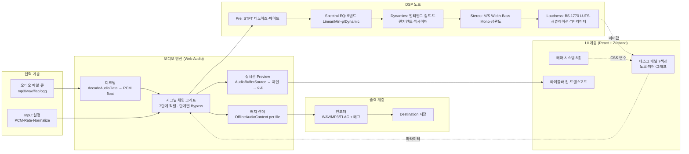
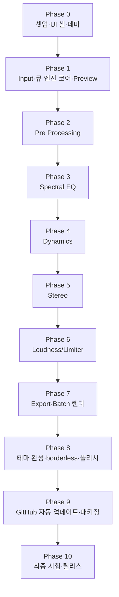
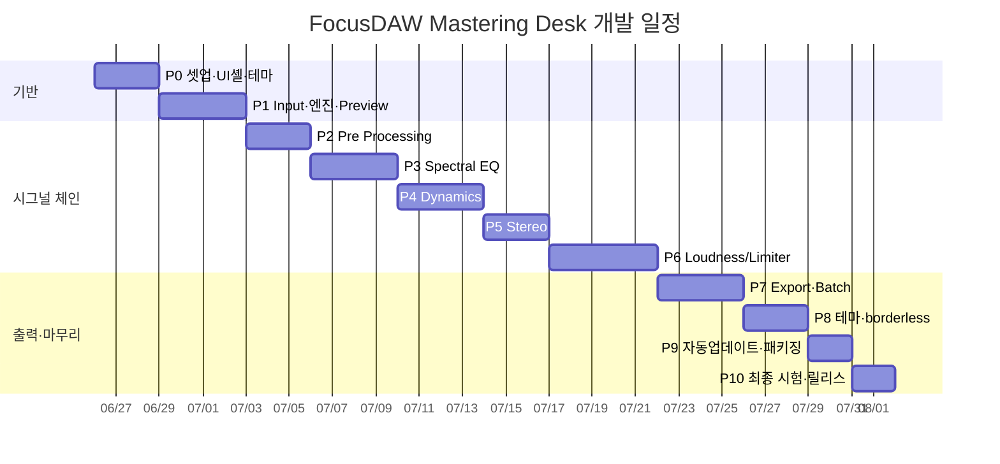

# 지침

1. 개발 내용을 단계별로 제안한다.
2. 최종 단계에서는 앱 시험에 대한 방안을 제시하고 시험이 완료되었을 때 최종 종료된다. (이것은 개발 과정의 시험과 다른, '프로젝트 종료' 단계에서의 최종 앱 시험에 대한 것임)
3. 스텝별, Phase별 개발이 필요한 경우 Mermaid 등으로 개발에 대한 전체 과정을 도식화 하여 제안한다.
4. 개발 일정을 time table로, 개발 항목별로 보여준다.

---

# 개발 - 프로세스

## 0. 프로젝트 개요

**제품명(가칭):** FocusDAW — Mastering Desk

MP3/WAV 등 오디오 파일을 입력받아 **7단계 마스터링 시그널 체인**(Input → Pre Processing → Spectral EQ → Dynamics → Stereo → Loudness/Limiter → Export)을 적용하고, 재생 중 실시간 미리듣기(Preview)와 큐 전체 일괄 렌더(Batch Export)를 지원하는 Electron 데스크톱 앱.

| 항목 | 내용 |
|------|------|
| **플랫폼** | Electron 단독 실행 앱(Windows 우선). borderless 윈도우. |
| **UI 프레임워크** | Vite + React + TypeScript + Tailwind CSS + Zustand (FocusSpectogram과 동일 스택) |
| **오디오 처리** | Web Audio API(실시간 Preview) + OfflineAudioContext(배치 렌더) + AudioWorklet(룩어헤드 리미터) |
| **디자인 기준** | `Mastering Desk Studio.dc.html` (실제 수정 대상 소스), `standalone.html`은 참고용 |
| **테마 시스템** | 8 테마(Teal/Sunset/Violet/Crimson + 각 Light). 구조는 `_refer/variations.html` 표준 팔레트 키 방식 참고 |
| **입력 포맷** | mp3 / wav / flac / ogg / m4a (브라우저 디코더 지원 범위) |
| **출력 포맷** | WAV / MP3 320 / FLAC (+ 메타데이터 태그, 앨범 아트워크) |
| **자동 업데이트** | electron-updater + GitHub Releases(electron-builder `publish: github`) |
| **재사용 자산** | 노이즈 제거·STFT·3D 스펙트로그램은 `_refer/FocusSpectogram/src/audio`, `src/viz` 이식 |

> **결정 필요(사용자 확인):** ①요청서 D항(GitHub 자동 업데이트)을 위해 공개/비공개 GitHub 저장소와 릴리스 채널이 필요합니다. 저장소 경로를 알려주세요. ②MP3/FLAC 인코딩은 WASM 라이브러리(lamejs / libflac.js)로 계획했습니다. 다른 선호가 있으면 알려주세요.

---

## 1. 기술 아키텍처

**상태 모델:** 모든 노브/토글 값은 Zustand 단일 스토어(`masterChain`)에 보관 → 실시간 Preview 그래프와 배치 렌더 양쪽이 동일 파라미터를 구독. 파일 배치 전체에 공통 적용(파일별 오버라이드는 향후 확장).

---

## 2. 단계별(Phase) 개발 계획

### Phase 0 — 프로젝트 셋업·UI 셸·테마 골격 `v0.1.0`
- Vite + React + TypeScript + Tailwind + Zustand 초기화, Electron 셸(borderless `frame:false` + 커스텀 타이틀바) 래핑
- 전역 버전 상수 `APP_VERSION` 정의·표시(타이틀바/About)
- `dc.html`의 데스크 레이아웃(7섹션: dk-input/pre/spectral/dynamics/stereo/loudness/export)을 React 컴포넌트 셸로 이식
- 테마 시스템 골격: 표준 팔레트 키 → CSS 변수 적용기(`applyTheme`), 우선 1~2테마로 동작 확인
- 폴더 구조 확정 (`/src/audio`, `/src/dsp`, `/src/ui`, `/src/store`, `/src/theme`, `/src/export`, `/electron`)

### Phase 1 — Input·큐·엔진 코어·Preview `v0.2.0`
- Source(Files/Folder, Recursive), PCM(16/24/32f), Rate(44.1k/48k/96k), Normalize 토글 구현
- 파일 큐 리스트(선택·◀▶ 이동, NOW SELECTED), 선택 파일 메타(포맷/길이/SR/채널/원본 LUFS) 표시
- `decodeAudioData` → 내부 PCM float 변환, Rate에 따른 Nyquist 상한 산출 유틸
- **오디오 엔진 코어**: 7단계 직렬 그래프 + 단계별 Bypass(dry pass-through), 재생/일시정지/트랜스포트
- 공통 노브 인터랙션 컴포넌트(세로 드래그·휠 1스텝·더블클릭 리셋·disable 처리), LED arc −135°~+135°

### Phase 2 — Pre Processing `v0.3.0`
- Denoise 토글 + Noise Depth(1/2/3), Fade In(0–2000ms)/Out(0–4000ms)
- STFT 스펙트럴 게이팅 디노이즈 — `_refer/FocusSpectogram` 노이즈 제거 방식 이식
- 시간×주파수×음세기 3D 워터폴 스펙트로그램 — FocusSpectogram `viz` 이식, 정보 패널(FFT 4096/Hann/75%/Bin/Floor·SNR·Reduction)

### Phase 3 — Spectral EQ `v0.4.0`
- 5밴드 파라메트릭(밴드1 Low Shelf, 2~4 Bell, 5 High Shelf; 셸프 Q=0.71 고정·disable)
- EQ 모드 Linear(FFT 컨볼루션)/Min-φ(Biquad)/Dynamic, 주파수 축 SR 연동(20Hz~Nyquist)
- 그래프 상호작용(노드 드래그=Freq/Gain, 노드 휠=Q ±0.1), 프리셋 카드(Normal/Pop/Dance/Classic/User) + Advanced 패널

### Phase 4 — Dynamics `v0.5.0`
- Linkwitz-Riley 3밴드 크로스오버 → 대역별 컴프(Low/Mid/High −18~0dB, Ratio 2/4/8) → 합산
- Transient(−50~+50%) 셰이퍼, Exciter(0~100%) 고조파
- 시각화: 멀티밴드 GR 막대, 트랜지언트 엔벨로프 파형, 익사이터 배음 막대 (노브 실시간 연동)

### Phase 5 — Stereo `v0.6.0`
- Width(0~200% M/S Side 게인), Reverb/Delay(0~30% send), Bass Mono(+ Bass 60~300Hz 크로스오버), Mono Compatibility
- **Correlation 미터 상시 표시**(on/off 무관): GOOD/CHECK/RISK 색, fold loss(dB)
- 시각화: Width 타원·Reverb 헤일로·Delay 고스트·Bass 모노 코어·mono fold 축

### Phase 6 — Loudness / Limiter `v0.7.0`
- True Peak(−3~0dBTP, 4× 오버샘플링), LUFS Target(−24~−6, BS.1770-4 게이팅 측정), Saturate(0~100%), Limiter 캐릭터(Clear/Punchy/Loud), TP Limit 토글
- 룩어헤드 리미터 AudioWorklet
- LUFS 미터 색(절대레벨 그라데이션), True Peak 경고(>−1dBTP 적색)
- **Saturation THD 과다 판정**(GENTLE/MUSICAL/HOT) → Saturate arc·숫자·전달곡선·배음 막대 연동
- 처리 순서: LUFS 게인 → Saturation → True Peak 리미팅(최종)

### Phase 7 — Export·Batch 렌더 `v0.8.0`
- 메타데이터(Album/Artist/Composer/Year/Genre), Album Artwork 드롭, Format(WAV/MP3 320/FLAC), Destination(`~/Masters/<Album>`)
- 인코더 통합(WAV 직접, MP3=lamejs, FLAC=libflac.js) + 태그 기록(ID3/Vorbis)
- **Batch Export**: 큐 전체를 OfflineAudioContext로 파일별 렌더 → 인코딩 → 저장, 진행률 UI
- 타이틀바 칩(Rate·Bit·Export Format) 실시간 표시

### Phase 8 — 테마 완성·borderless·폴리시 `v0.9.0`
- 8테마(Teal/Sunset/Violet/Crimson + Light) 전 섹션 일관 적용, 경고색(빨강/노랑) 고정값 분리
- borderless 커스텀 윈도우 컨트롤(최소화/최대화/닫기·드래그 영역), 전체 디자인 정합(`dc.html` 대비)
- 성능/메모리 튜닝(대용량 파일·배치)

### Phase 9 — GitHub 자동 업데이트·패키징 `v0.10.0`
- electron-builder NSIS 빌드 + `publish: github`, electron-updater로 기동 시 업데이트 확인/다운로드/재시작
- 코드 서명 여부 결정, 릴리스 워크플로 정리

### Phase 10 — 최종 시험·릴리스 `v1.0.0`
- 아래 "5. 최종 앱 시험 방안" 수행 → 통과 시 프로젝트 종료

---

## 3. 개발 일정 (Time Table)

> 1인 개발 기준 추정. 각 Phase는 구현 + 단위 시험 + `앱개발.md`/`시험.md` 기록 포함.

| Phase | 개발 항목 | 산출물 | 버전 | 예상 기간 |
|-------|-----------|--------|------|-----------|
| 0 | 셋업·UI 셸·테마 골격 | 실행 가능한 빈 데스크 셸 | v0.1.0 | 3일 |
| 1 | Input·큐·엔진 코어·Preview | 파일 로드 + 재생 + 체인 그래프 | v0.2.0 | 4일 |
| 2 | Pre Processing | 디노이즈·페이드·3D 워터폴 | v0.3.0 | 3일 |
| 3 | Spectral EQ | 5밴드 EQ + 그래프·프리셋 | v0.4.0 | 4일 |
| 4 | Dynamics | 멀티밴드 컴프·트랜지언트·익사이터 | v0.5.0 | 4일 |
| 5 | Stereo | Width·Bass Mono·상관도 미터 | v0.6.0 | 3일 |
| 6 | Loudness/Limiter | LUFS·TP 리미터·새츄레이션 | v0.7.0 | 5일 |
| 7 | Export·Batch 렌더 | 인코딩·태그·일괄 내보내기 | v0.8.0 | 4일 |
| 8 | 테마 완성·borderless·폴리시 | 8테마 + 디자인 정합 | v0.9.0 | 3일 |
| 9 | GitHub 자동 업데이트·패키징 | 자동 업데이트 설치본 | v0.10.0 | 2일 |
| 10 | 최종 시험·릴리스 | v1.0.0 릴리스 | v1.0.0 | 2일 |
| | | | **합계** | **약 37일(7~8주)** |

---

## 4. 산출물·문서 연계
- **A2. 앱개발.md** : 각 Phase 구현 시 "앱 개발 내용"/"History"에 실제 내용 기록(버전 규칙 v{Major}.{Minor}.{Patch} 준수), "버그"·"다음 작업" 섹션 관리
- **A3. 시험.md** : 각 Phase 완료 시 자동/수동 시험 항목·절차 추가(완료분은 시험-아카이브.md 이관) — *현재 요청에서는 작성 보류*
- **A4. 수정요청.md** : 사용자 피드백/버그 수정 사이클 관리 — *현재 요청에서는 작성 보류*

---

## 5. 최종 앱 시험 방안 (프로젝트 종료 단계)

> 본 절은 개발 과정 중 단위 시험과 별개로, **v1.0.0 릴리스 전 최종 인수 시험(Acceptance Test)** 이다.
> 모든 항목 통과 시 프로젝트를 종료한다. 세부 절차는 `A3. 시험.md`에 동기화한다.

### 5.1 자동 시험 (스스로 수행)
| # | 시험 항목 | 판정 기준 |
|---|-----------|-----------|
| A1 | 다중 포맷 디코딩(mp3/wav/flac/ogg) | 모든 샘플 정상 로드, 메타데이터 정확 |
| A2 | LUFS 측정 정합성(BS.1770-4) | 기준 톤 대비 통합 LUFS 오차 < ±0.5 LU |
| A3 | True Peak 측정(4× 오버샘플) | 인터샘플 피크 검출, 천장 초과 0건(리미팅 후) |
| A4 | Bypass 무결성 | 전 단계 Bypass 시 입력 대비 비트 동일(dry) |
| A5 | 배치 렌더 일관성 | Preview와 동일 파라미터로 렌더 결과 일치 |
| A6 | 빌드 무결성 | Electron 빌드 에러 0, 콘솔 에러 0 |

### 5.2 수동 시험 (사용자 수행)
| # | 시험 항목 | 판정 기준 |
|---|-----------|-----------|
| M1 | 파일/폴더 로드·큐 선택·메타 표시 | 정상 입력 및 메타 일치 |
| M2 | 7단계 노브/토글 실시간 Preview 반응 | 드래그·휠·더블클릭 즉시 청감 반영 |
| M3 | Spectral EQ 그래프 인터랙션 | 노드 드래그/휠로 Freq·Gain·Q 정확 변경 |
| M4 | Batch Export 후 결과물 품질 | 포맷·태그·아트워크·라우드니스 목표 부합 |
| M5 | 8테마 전환 일관성 | 전 섹션 색 일관·경고색 고정 유지 |
| M6 | borderless 윈도우 조작 | 드래그·최소/최대/닫기 정상 |
| M7 | GitHub 자동 업데이트 | 새 릴리스 감지·다운로드·재시작 적용 |
| M8 | 디자인 일치도 | `Mastering Desk Studio.dc.html`과 시각적 동등 |

### 5.3 종료 조건
- 자동 시험 A1~A6 전부 PASS
- 수동 시험 M1~M8 전부 사용자 승인
- 잔여 Critical/Major 버그 0건 → **v1.0.0 릴리스 및 프로젝트 종료**
