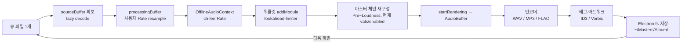

# 지침

1. 앱 버전 관리 규칙 : v{Major}.{Minor}.{Patch}
   - Major : 사용자 선택 사항.
   - Minor : "A1. 개발-프로세스.md" 의 phase 별 버전 규칙을 따름.
   - Patch : 버그 수정. 기존 기능 개선 또는 수정. 개발 phase가 변경되지 않는 수정 사항들 모두.

그외, 애매한 부분에 대해서는 사용자에게 버전 변경을 물어본 뒤 그 내용을 기록한다.
앱 버전을 앱 내의 global 상수로 기록하고 조회, 표시 될 수 있도록 한다.

코드 작성 중 {Minor} 변경 사항에 대해, 모듈/블록 추가에 대해서는 앱 버전을 comment로 기록해둔다.
코드 작성 중 {Patch} 변경 사항에 대해, 수정 내용 부분에 앱 버전을 comment로 기록해둔다.

2. 섹션 : "앱 개발 내용" - 앱 전체 개발에 대한 구체적인 계획 및 내용을 기록한다. (실제 앱 설계서)

3. 섹션 : "앱 버전별/날짜별 개발, 추가, 수정 등의 작업 History"
   - 실제 개발된 내용을 기록한다. 직접 코드를 여기에 작성하는 일은 최소화 하되, 꼭 필요하다면 추가한다.
   - 모듈별 또는 Phase별로 지난 내용에 대해서는 모두 "앱개발-아카이브.md"로 이관/정리한다.

4. 섹션 : "버그" - 자체적으로 파악한 버그 및 사용자가 보고한 버그 사항을 표로 정리하여 모두 기록한다. 앱 버전과 보고된 날짜를 기록하고 이후 처리 상황에 따라 표를 정리한다.

5. 섹션 : "다음 작업 할 내용 정리" - 위 "앱 버전별/날짜별 개발, 추가, 수정 등의 작업 History" 이후에 진행해야할 작업 내용을 미리 기록해 둔다. 필요하다면 승인 받아야 할 내용도 함께 기록해서 이후 바로 진행 될 수 있도록 내용을 정리한다.

---

# 앱 개발 내용 (앱 설계서)

## 0. 제품 정의

| 항목 | 내용 |
|------|------|
| 제품명(가칭) | FocusDAW — Mastering Desk |
| 목적 | 오디오 파일에 7단계 마스터링 체인 적용 → 실시간 Preview + 일괄 Export |
| 플랫폼 | Electron 단독 실행(Windows 우선), borderless 윈도우 |
| 스택 | Vite + React + TypeScript + Tailwind + Zustand / Web Audio API / electron-builder |
| 디자인 소스 | `Mastering Desk Studio.dc.html` (실제 수정 대상), `standalone.html`(참고) |
| 버전 상수 | `src/version.ts` → `export const APP_VERSION = 'x.y.z'` (타이틀바·About 표시) |

## 1. 폴더 구조 (계획)

```
src/
  audio/      디코딩·파일픽커·플레이어·STFT (FocusSpectogram 이식)
  dsp/        체인 노드: pre, eq, dynamics, stereo, loudness, limiter.worklet
  export/     wav / mp3(lamejs) / flac(libflac) 인코더 + 태그(ID3/Vorbis)
  ui/         desk 7섹션 패널 + 공통 Knob·Meter·Graph 컴포넌트
  store/      appStore (masterChain 파라미터·큐·재생상태)
  theme/      8테마 정의 + applyTheme(CSS 변수)
  version.ts
electron/     main.cjs(borderless·autoUpdater) · preload.cjs
```

## 2. 시그널 체인 설계 (7단계)

신호: SOURCE → Input → Pre → Spectral EQ → Dynamics → Stereo → Loudness/Limiter → Export(MASTER). 좌→우 직렬. 각 단계 **Bypass = dry pass-through**. 모든 주파수 상한 = `min(설정값, Nyquist=SR/2)`.

| # | 단계 | 핵심 컨트롤 | DSP 구현 |
|---|------|------------|----------|
| I | Input | Source·PCM·Rate·Recursive·Normalize | decodeAudioData → PCM float, Nyquist 산출 |
| II | Pre | Denoise·Noise Depth(1/2/3)·Fade In/Out | STFT 스펙트럴 게이팅(FocusSpectogram) + 3D 워터폴 |
| III | Spectral EQ | 5밴드(Shelf+Bell), **Min-φ 단일** | BiquadFilter(Min-φ) — Linear/Dynamic 모드 범위 제외(2026-06-28) |
| IV | Dynamics | Low/Mid/High·Ratio·Transient·Exciter | LR 3밴드 크로스오버 + DynamicsCompressor + 셰이퍼/익사이터 |
| V | Stereo | Width·Reverb·Delay·Bass Mono·Mono Compat | M/S 처리, 저역 크로스오버 모노, 상관도 측정(상시) |
| VI | Loudness | True Peak·LUFS·Saturate·Limiter·TP Limit | BS.1770-4 LUFS, 4× 오버샘플 TP, 룩어헤드 리미터 Worklet |
| VII | Export | 메타·아트워크·Format·Destination | OfflineAudioContext 렌더 → 인코딩 → 태그 |

### Sampling Rate / Buffer 정책 (확정 방향)

Input의 `Rate(44.1k / 48k / 96k)`는 **내부 처리 샘플레이트**로 정의한다. 원본 파일의 샘플레이트와 PC H/W 출력 장치 샘플레이트가 달라도, DSP와 Export 결과가 사용자 설정 Rate 기준으로 일관되도록 다음 구조를 사용한다.

#### 1) 버퍼 역할 분리

| 버퍼 | 샘플레이트 | 용도 | 변경 시점 |
|------|------------|------|-----------|
| `sourceBuffer` | 원본 파일 샘플레이트 보존 | 좌측 원본 Play, 재처리 기준 원본 | 파일 로딩 시 생성 후 유지 |
| `processingBuffer` | 사용자 설정 Rate | 중앙 Preview, II~VI DSP, Batch Export | Rate 변경 또는 최초 Preview/Export 시 생성/재생성 |

예: 원본 44.1kHz 파일을 불러오고 사용자가 Input Rate를 48kHz로 설정한 경우:

```text
sourceBuffer.sampleRate = 44100
processingBuffer.sampleRate = 48000

좌측 원본 Play:
sourceBuffer → AudioContext.destination

중앙 Preview:
processingBuffer → Pre/EQ/Dynamics/Stereo/Loudness chain → AudioContext.destination

Batch Export:
processingBuffer 또는 sourceBuffer→OfflineAudioContext(48000) 렌더 → 48kHz 파일 출력
```

#### 2) PC H/W 샘플레이트와의 관계

PC 오디오 장치/OS/`AudioContext.sampleRate`는 사용자마다 44.1kHz, 48kHz, 96kHz 등으로 다를 수 있다. 이 값은 **최종 스피커 출력 레이트**일 뿐, 앱의 DSP 기준으로 사용하지 않는다.

- DSP 기준 샘플레이트: `processingBuffer.sampleRate`
- EQ Nyquist, STFT bin, limiter/oversampling 기준: 사용자 설정 Rate / `processingBuffer.sampleRate`
- 최종 스피커 출력 변환: Web Audio가 `AudioContext.destination`에서 장치 레이트에 맞춰 처리

따라서 H/W sample rate가 달라도, 같은 입력·같은 설정이면 마스터링 처리 기준은 동일해야 한다. 구현 시 `AudioContext.sampleRate`를 DSP 기준으로 직접 참조하지 않도록 주의한다.

#### 3) 파일 로딩 후 Rate 변경 대책

사용자가 파일을 불러온 뒤 Input Rate를 바꾸는 경우:

1. `sourceBuffer`는 원본 보존용이므로 변경하지 않는다.
2. 현재 재생 중인 원본/Preview를 정지한다.
3. 기존 `processingBuffer`와 `processingSampleRate`를 무효화한다.
4. UI의 Rate chip, EQ Nyquist, 그래프 주파수 상한은 즉시 새 Rate 기준으로 갱신한다.
5. 다음 Preview 또는 Export 시 `sourceBuffer`를 새 사용자 Rate로 리샘플링해 `processingBuffer`를 다시 만든다.

권장 구현은 **Lazy 변환**이다. Rate 변경 즉시 큐 전체를 변환하지 않고, 필요한 파일을 Preview/Export 할 때 `processingBuffer`가 없거나 `processingSampleRate !== userRate`이면 그때 변환한다. 긴 파일/다중 파일 큐에서 불필요한 대기 시간을 줄이기 위함이다.

```ts
type QueueFile = {
  sourceBuffer: AudioBuffer;        // 원본 보존
  processingBuffer?: AudioBuffer;   // 사용자 Rate 내부 처리용
  processingSampleRate?: number;
  meta: AudioMeta;
}
```

> v0.2.2에서 `QueueFile`은 `sourceBuffer`/`processingBuffer` 구조로 전환되었다. `processingBuffer`는 Preview 실행 시 사용자 Input Rate 기준으로 lazy 생성된다.

### 공통 노브 동작 규칙
- 세로 드래그(위=증가, 감도 ≈ 범위/140px), 휠 1노치=1스텝(정수 ±1·소수 ±0.1·주파수 ±5Hz), 더블클릭=기본값 리셋.
- 상위 토글 off → 종속 노브 회색+입력 차단(Bass Mono off→Bass, TP Limit off→True Peak 등).
- LED/arc 링 `-135°~+135°`(270°) 값 비례.

### 처리/측정 세부 (요청서·_참고 반영)
- **Noise Depth**: 1=Original(최소)·2=Normal·3=Deep. 기존 앱(FocusSpectogram) 노이즈 제거 방식 사용.
  - **음악 MP3 음원별 지능형 Denoise 설정 추천 기준**:
    | SNR 범위 | 판정 상태 | 추천 Depth | 추천 노브량 | 표시 색상 |
    | :--- | :--- | :---: | :---: | :---: |
    | 100 dB 이상 | Very Clean | Original (1) | 5% | 파란색 (`#4ea5ff`) |
    | 90 ~ 100 dB | Clean | Original (1) | 10% | 파란색 (`#4ea5ff`) |
    | 80 ~ 90 dB | Light Clean | Original (1) | 25% | 초록색 (`#46d36e`) |
    | 60 ~ 80 dB | Moderate Noise | Normal (2) | 10% | 연두색 (`#a2db34`) |
    | 40 ~ 60 dB | Heavy Noise | Normal (2) | 30% | 오렌지색 (`#ff983d`) |
    | 40 dB 미만 | Extreme Noise | Deep (3) | 50% | 붉은색 (`#ff5a5a`) |
- **Correlation 미터**: 측정값 → 토글과 무관하게 항상 표시(≥0.5 GOOD/0~0.5 CHECK/<0 RISK), fold loss(dB) 상시.
- **Saturation THD 판정**: THD% + 짝수/홀수 배음비 + 크레스트 팩터 감소 + 고역 누적/TP 상승 + 모노 청감 → GENTLE/MUSICAL/HOT, Saturate arc·숫자·전달곡선·배음 막대 전체 연동.
- **LUFS 미터 색**: 절대레벨 기준 −14↓파랑 → −9 초록 → −7 노랑 → 빨강(그라데이션 블렌딩).

## 3. 테마 시스템
- 8테마: Teal / Sunset / Violet / Crimson + 각 Light(명도 반전). 표준 팔레트 키(`_refer/variations.html` 방식) → CSS 변수.
- 액센트(메인/밝은/글로우/잉크) + 배경(데스크/시트/패널/카드) 일관 적용. 경고색(빨강/노랑)은 테마 무관 고정.

## 4. 빌드·배포·자동 업데이트
- electron-builder NSIS(Windows), `publish: github` → 저장소 `limsunglyong/FocusDAW-Mastering` Releases.
- electron-updater: 기동 시 업데이트 확인 → 다운로드 → 재시작 적용.
- 타이틀바 칩: Input Rate·Bit, Export Format 실시간 표시.
- **코드 서명**: 초기 미서명 빌드. 미서명 시 Windows SmartScreen 경고가 뜰 수 있으나 빌드/업데이트 구조는 동일 → 추후 OV 인증서 발급 시 `electron-builder` 서명 설정만 추가(구조 변경 없음).

## 4-1. 확정 사항 (2026-06-26)
- GitHub 저장소: `https://github.com/limsunglyong/FocusDAW-Mastering.git`
- 인코더: MP3 = lamejs, FLAC = libflac.js
- 코드 서명: 미서명으로 시작(추후 OV 인증서 확장 가능)

---

# 앱 개발 계획 (Phase 별)

> 상세 일정·도식은 `A1. 개발-프로세스.md` 참조. 각 Phase 완료 시 본 문서 History와 `A3. 시험.md`에 기록.

| Phase | 버전 | 내용 | 상태 |
|-------|------|------|------|
| 0 | v0.1.x | 셋업·UI 셸·테마 골격·버전 상수 | **완료 — 현재 v0.1.1 (원본 UI 충실 이식 포함)** |
| 1 | v0.2.0 | Input·큐·엔진 코어·Preview·공통 노브 | **완료** — 실제 파일 입력·큐·디코딩·메타·원본 LUFS·Preview 재생 연결 완료 |
| 2 | (v0.2.24~33) | Pre Processing(디노이즈·페이드·3D 워터폴) | **완료** — STFT 스펙트럴 디노이즈, 3D 워터폴 서피스, SNR 적응형 추천 탑재 완료. *(계획상 v0.3.0 Minor 승격은 생략하고 v0.2.x 패치로 완료 — 버전 정합성 메모 참조)* |
| 3 | v0.4.x | Spectral EQ(5밴드·Min-φ·그래프·프리셋) | **완료** — 5밴드 Biquad(Min-φ), 그래프 노드 드래그(Freq/Gain)·휠(Q±0.1), SR 연동 주파수축, 프리셋 5종(Normal/Pop/Dance/Classic/User)·User 저장·Advanced 패널. **Linear/Dynamic 모드는 범위 제외(2026-06-28 사용자 확정).** |
| 4 | v0.5.0 | Dynamics(멀티밴드 컴프·트랜지언트·익사이터) | **완료(Preview)** — LR 3밴드 크로스오버·대역별 컴프·트랜지언트(어택/릴리즈)·익사이터(고역 하모닉) 구현. *(트랜지언트 정밀 셰이퍼·Export 정밀화는 후속)* |
| 5 | v0.6.0 | Stereo(Width·Bass Mono·상관도) | **완료(Preview)** — Width(M/S)·Bass Mono·Reverb/Delay send·Mono Compat·실측 Correlation 미터(상시) 구현. *(Export 정밀화는 후속)* |
| 6 | v0.7.0 | Loudness/Limiter(LUFS·TP·새츄레이션) | **완료(Preview)** — LUFS make-up 게인·Saturation·**룩어헤드 TP 리미터(AudioWorklet)**·캐릭터별 릴리즈·THD 판정. *(정밀 폴리페이즈 ISP TP·Export 정밀화는 후속)* |
| 7 | v0.8.0 | Export·Batch 렌더(인코딩·태그) | **진행 중** — 마스터 체인 빌더 분리(7-A)·오프라인 정밀 렌더(7-B)·**WAV(RIFF) 인코더(7-C)**·Electron 파일 저장 IO(7-D)·Export UI(단일/배치·진행률·취소·아트워크·Destination, 7-F/7-G)·**MP3 320(ID3v2+APIC)·FLAC(VORBIS_COMMENT+PICTURE) 인코더(7-E, v0.8.4)** 까지 **WAV/MP3/FLAC end-to-end 동작**. *(Preview↔Export 정합 시험(7-H)·MP3/FLAC 사용자 청취 확인은 후속.)* |
| 8 | v0.9.0 | 테마 완성·borderless·폴리시 | 예정 |
| 9 | v0.10.0 | GitHub 자동 업데이트·패키징 | 예정 |
| 10 | v1.0.0 | 최종 인수 시험·릴리스 | 예정 |

---

# 앱 버전별/날짜별 개발, 추가, 수정 등의 작업 History

| 버전 | 날짜 | 구분 | 내용 |
|------|------|------|------|
| v0.8.8 | 2026-06-29 | Patch | **매뉴얼 VI. Loudness 세부 내용 보강.** ① [ManualWindow.tsx](src/ui/desk/ManualWindow.tsx)의 VI. Loudness / Limiter 섹션 하단에 `Saturate` 장단점 설명 가이드 카드 및 `LUFS` 개념·방송과 음원의 차이·주요 플랫폼별 권장 타겟 레벨(YouTube/Spotify -14, Apple Music -16, 상업 마스터 -9~-8) 설명 가이드 카드를 다국어(Ko/En)로 추가하여 음압 확보 과정에서의 왜곡 및 스트리밍 규격에 대한 사용자의 이해도 제고. |
| v0.8.7 | 2026-06-29 | Patch | **매뉴얼 보강 및 독립 창(Non-blocking) 전환.** ① **매뉴얼 노이즈 추천 기준 보강** — [ManualWindow.tsx](src/ui/desk/ManualWindow.tsx)의 Pre-processing(II) 섹션에 자동 노이즈 탐색 설명 및 SNR 기준 지능형 추천 설명 문구를 추가하고, SNR 범위(Very Clean ~ Extreme Noise)별 추천 Depth 및 Amount를 보여주는 다국어(Ko/En) 추천 기준표 추가. ② **매뉴얼 창 독립화(포커스/조작 블로킹 해제)** — 기존 `electron/main.cjs`에서 매뉴얼 창 생성 시 `parent: parentWindow`가 지정되어 Windows OS 등에서 메인 창의 포커스 획득 및 조작이 차단되던 현상을 해결하기 위해 `parent: undefined`로 독립 창(Non-blocking) 전환. 매뉴얼을 띄워둔 상태로 메인 화면의 노브 조작 및 재생이 정상적으로 가능. |
| v0.8.6 | 2026-06-28 | Patch | **Footer Transport 토글 및 Transport 패널 Stop 버튼 추가(사용자 직접 커밋).** ① [Footer.tsx](src/ui/desk/Footer.tsx) 중앙에 Transport 패널 열기/닫기(F4) 버튼 추가. ② [TransportPanel.tsx](src/ui/desk/TransportPanel.tsx) 컨트롤 버튼 영역에 재생 정지 및 처음 위치 이동(Stop) 버튼 추가. |
| v0.8.5 | 2026-06-28 | Phase 7 (Patch) | **Export 사용성/버그 수정 5건(사용자 보고).** ① **Format 라벨 'MP3 320'→'MP3'** ([data.ts](src/desk/data.ts) opts·[exportRunner.ts](src/export/exportRunner.ts) 값 통일). ② **앨범아트(섹션 VII) 이미지 드롭이 섹션 I 큐로 흘러가 "Unsupported format: .jpg" 에러**나던 것 수정 — [Viz.tsx](src/ui/desk/Viz.tsx) 아트워크 드롭존은 `stopPropagation` 유지(루트 오디오 로더 차단)하고, "Drop audio files" 오버레이 해제는 [App.tsx](src/App.tsx)의 **window 캡처 `drop`/`dragend` 리스너**가 담당(자식 stopPropagation 과 무관하게 항상 해제 → 고착 방지). ③ **Export 진행 표시 + 완료 알림** — exporting 중 전역 **LoadingCard(EXPORTING)** 오버레이, 완료 시 **ExportNotice 모달**(저장 개수·경로·Reveal/OK). [appStore.ts](src/store/appStore.ts) `exportNotice` 상태·`clearExportNotice` 추가, 무거운 작업 전 30ms 양보 + MP3/FLAC 인코드 루프 주기적 yield. 로딩 표시는 **출력 파일명(현재 포맷 확장자)**, 단일 파일은 하위 진행률이 없어 **불확정(스피너) 표시**(오해되는 0% 제거). ④ **FLAC `require` 번들 오류 수정** — 고수준 `libflacjs/lib/encoder`(UMD 내부 `require('./utils/data-utils')`)가 Vite/rolldown 런타임에서 `require` 미정의 오류를 내던 것을, **자체완결 `dist/libflac.js` 저수준 API 직접 호출**(create/init_stream/process/finish/delete)로 교체([flac.ts](src/export/flac.ts), 래퍼 미사용). ⑤ MP3 는 사용자 확인 완료(저장·태그·아트워크 정상). **검증:** `npm run lint`·`npm run build` 통과. *(FLAC 저장은 재시험 필요.)* |
| v0.8.4 | 2026-06-28 | Phase 7 (7-E) | **Export MP3 320·FLAC 인코더 + 태그·아트워크.** WAV 외 두 포맷을 end-to-end 로 추가. ① **MP3 320** — `@breezystack/lamejs`(CBR 320), 신규 [mp3.ts](src/export/mp3.ts). MP3 미지원 레이트(96kHz 등)는 `OfflineAudioContext` 로 48kHz 리샘플 후 인코딩. **ID3v2.3 태그**(TIT2/TPE1/TALB/TYER/TCON, UTF-16 BOM 으로 한글 지원) + **APIC 앨범아트** 임베드(신규 [id3.ts](src/export/id3.ts), 의존성 0). ② **FLAC** — `libflacjs` **자체완결 asm.js 변형**(별도 .wasm/.mem 불필요 → Electron 오프라인 안전), 신규 [flac.ts](src/export/flac.ts). Input PCM 16/24(32f→24) 정수 인코딩(compression 5). libflacjs 가 인코딩-시 메타 주입 API 가 없어, 인코딩 후 **VORBIS_COMMENT(TITLE/ARTIST/ALBUM/DATE/GENRE) + PICTURE(front cover) 메타데이터 블록을 직접 파싱·삽입**(기존 vorbis/picture 제거, STREAMINFO 유지, last-flag 정정). ③ [exportRunner.ts](src/export/exportRunner.ts) `encodeMaster` 가 `meta`(제목=파일명·아티스트/앨범/연도/장르·아트워크 dataURL)를 받아 분기, `SUPPORTED_EXPORT_FORMATS = WAV/MP3 320/FLAC`. [appStore.ts](src/store/appStore.ts) `runExport` 가 Export 메타·`artworkDataUrl` 을 전달. ④ 두 인코더는 **동적 import**(lamejs 163KB·libflac 367KB 별도 청크 → 메인 번들 931KB 유지, 기동 비용·로딩 이슈 격리). **검증:** `npm run lint`·`npm run build` 통과. *(실제 MP3/FLAC 파일 재생·태그·아트워크 확인은 사용자 시험 필요 — 특히 libflac asm.js 런타임 로드.)* |
| v0.8.3 | 2026-06-28 | Patch | **IV Dynamics — Multiband on/off 스위치 + 기본값 정리.** 사용자 요청 반영. ① **Multiband 스위치** — 섹션 전체 Bypass 와 별개로 **3밴드 컴프만 우회**하는 토글을 IV 상세창 PARAMETERS 에 추가(**Multiband 스위치 → Ratio** 순). [data.ts](src/desk/data.ts) `CTRL.dynamics` 에 `multiband`(sw) 추가(기본 ON)·`DEFAULT_STATE.vals['dynamics.multiband']=true`. [masterChain.ts](src/audio/masterChain.ts): 멀티밴드 컴프를 `mbDry/mbWet` dry/wet 으로 감싸 `bandSum` = (OFF=input 직통) | (ON=3밴드 컴프 합) 으로 구성 → 재생 중 토글해도 `AudioBufferSource` 재빌드 없이 crossfade(`applyMasterChainParams` 가 `vals['dynamics.multiband']` 로 mbDry/mbWet 갱신). 익사이터는 `bandSum` 에서 추출하므로 OFF 시 원신호 고역에 작동(컴프만 우회). `DynGraph` 에 `mbDry/mbWet` 추가. **Multiband OFF 시 좌측 GR 막대·값을 회색**([compute.ts](src/desk/compute.ts) `dynBars`), **Transient 노브·viz 도 비활성(회색+입력 차단)**([Controls.tsx](src/ui/desk/Controls.tsx), `dynMbOn`) — Transient 는 밴드 컴프 attack/release 변조라 OFF 면 무효(on/off 직관 표시). ② **기본값 정리(깨끗한 디폴트)** — `dynamics.multiband` **OFF**, `dynamics.low/mid/high` −4/−2/−3 → **−2/−1/−1**(압축 완화), `dynamics.transient` 15→**10%**, `dynamics.exciter` 25→**15%**. IV↔VI 상호작용(압축으로 신호가 촘촘해져 VI 새츄레이터를 과구동→왜곡 가중) 논의에 따른 조치. **검증:** `npm run lint`·`npm run build` 통과. *(사용자 청취 확인 대기)* |
| v0.8.2 | 2026-06-28 | Patch (버그 #3) | **IV Dynamics 사용 시 "지직" 왜곡 해소 — 진짜 원인은 VI Loudness 새츄레이터.** 사용자 단계별 청취 시험으로 원인 격리: ① 크로스오버 합산은 정상(주파수응답 시뮬 ±0.12dB), ② 익사이터 무관(0%에서도 발생), ③ 컴프 무죄(make-up 강제 1.0 시 −18 강압축도 깨끗), ④ 리미터 이후에도 잔존(=리미터 전 생성), ⑤ Saturate=0% 시 소멸 → **새츄레이터 확정**. 근본 결함은 [masterChain.ts](src/audio/masterChain.ts) `loudnessSatCurve` 의 `drive=1+a*8` 매핑 — base "1" 때문에 Saturate 가 0.2% 만 넘어도 tanh 가 곧장 걸려 **기본 5% 인데도 0dBFS 부근 피크에 ~9% THD** 를 더하고 피크를 으깼다(Dynamics make-up·압축이 신호를 그 영역으로 밀어넣는 방아쇠). **수정 3종(게인스테이징 계열):** ① **새츄레이터 재설계** — 선형↔tanh **blend(=Saturate%)** 로 교체: 저%는 거의 선형(피크는 통과시키고 천장은 리미터가 담당)·%를 올릴수록 하모닉 캐릭터만 추가(5% THD **8.9%→1.8%**, 0%=완전 투명, 0dBFS unity 유지, `LOUDNESS_SAT_DRIVE=4` 고정). ② **새츄레이터 헤드룸 ±8→±32**(+18→+30dB, n 2048→8192) — make-up 누적이 도메인 끝에서 하드클립되지 않게. ③ [dynamics.ts](src/audio/dynamics.ts) **밴드 make-up 계수 0.3→0.12** 완화(−18dB 밴드 +5.4→+2.2dB, 최종 음량은 VI 가 담당). **검증:** `npm run lint`·`npm run build` 통과 + **사용자 청취 확인**(기본값·−18 노이즈 확실히 감소, Saturate 50~100% 의 미세 하모닉은 의도된 새츄레이션). |
| v0.8.1 | 2026-06-28 | Phase 7 (Patch) | **Export 결과물 하드클립/찌그러짐 수정.** 사용자 보고(원본 대비 찌그러짐) 반영 — 오프라인 렌더가 True-Peak 리미터를 `OfflineAudioContext` 의 `AudioWorklet` 에 의존했는데, 오프라인 워클릿 로드/동작이 누락되면 Loudness 단의 make-up 게인+새츄레이터 출력(최대 +18dB 헤드룸, ±8)이 리미터에 못 잡혀 [wav.ts](src/export/wav.ts) 에서 ±1 로 **하드클립**되어 찌그러졌다. [renderOffline.ts](src/export/renderOffline.ts): Loudness 체인을 워클릿 없이 빌드(headroom 통과)하고, 렌더된 PCM 에 **결정적 JS 브릭월 리미터**(신규 [limiter.ts](src/export/limiter.ts), `limiterWorklet.ts` 룩어헤드 알고리즘 1:1 포팅)를 적용해 항상 `ceiling` 이하 보장(Preview 와 동일 의도). 룩어헤드 지연은 리미터 내부에서 flush·정렬(기존 front-trim 제거). **검증:** `npm run lint`·`npm run build` 통과. *(사용자 청취 확인 대기)* |
| v0.8.0 | 2026-06-28 | Phase 7 (Minor 착수) | **Export 착수 — WAV 단일/배치 내보내기 end-to-end.** ① **7-A 마스터 체인 빌더 분리** — Preview 의 섹션 DSP(Input→Pre fade→Spectral EQ→Dynamics→Stereo→Loudness/limiter) 구성을 컨텍스트 무관 함수로 추출한 신규 [masterChain.ts](src/audio/masterChain.ts)(`buildMasterChain`/`applyMasterChainParams`/`makeReverbIR` + 곡선·매핑 헬퍼). [previewEngine.ts](src/audio/previewEngine.ts) 는 이 위에 dry/wet A/B·master 볼륨·상관도 탭만 덧씌우는 얇은 래퍼로 재구성(`PreviewParams` 재노출, 출력 동일). ② **7-B 오프라인 정밀 렌더** — 신규 [renderOffline.ts](src/export/renderOffline.ts) `renderMaster(buffer, params)`: `OfflineAudioContext(ch·len·rate)` + `audioWorklet.addModule`(룩어헤드 리미터) → 동일 마스터 체인 1회 빌드(Pre fade offset 0) → `startRendering`. **리미터 룩어헤드 지연만큼 앞쪽 trim** 보정, **Mono Master ON=1ch** 출력. ③ **7-C WAV 인코더(의존성 0)** — 신규 [wav.ts](src/export/wav.ts): 렌더 PCM → 인터리브 → WAV(RIFF), **Input PCM(16/24/32f)** 연동(16/24=정수, 32f=IEEE float). ④ **7-D Electron 파일 저장 IO** — [main.cjs](electron/main.cjs)에 `export:default-dir`(<Music>/Masters)·`export:pick-dir`(폴더 다이얼로그)·`export:save-file`(mkdir recursive + 중복 시 ` (n)` 회피)·`export:reveal`, [preload.cjs](electron/preload.cjs)/[global.d.ts](src/global.d.ts) `exportIO` 노출. ⑤ **7-C 디스패처** — 신규 [exportRunner.ts](src/export/exportRunner.ts) `encodeMaster`(현재 WAV만, MP3/FLAC 는 `ExportUnsupportedError`). ⑥ **7-F/7-G UI·오케스트레이션** — [appStore.ts](src/store/appStore.ts): `exportSelected`/`exportBatch`(per-file `effectivePlaybackBuffer`→렌더→인코딩→저장, LRU=1 로 메모리 일정)·진행률(`exporting`/`exportTotal`/`exportDone`)·취소·에러수집·`pickExportDir`/`setArtwork`/`revealLastExport`. [Controls.tsx](src/ui/desk/Controls.tsx) Export 패널에 **EXPORT SELECTED/ALL 버튼·진행 막대·Cancel·Reveal**, [Viz.tsx](src/ui/desk/Viz.tsx) **Album Artwork 드롭/미리보기·Destination 폴더 선택**. **비고:** MP3 320(lamejs)·FLAC(libflac.js) 인코더+ID3/Vorbis 태그·아트워크 임베드(7-E), Preview↔Export 정합 시험(7-H, A5)은 후속. 현재 메타/아트워크는 표시·수집만(WAV 미임베드). WAV 외 포맷 선택 시 안내 메시지. **검증:** `npm run lint`·`npm run build` 통과. |
| v0.7.4 | 2026-06-28 | Patch | **Preferences 검은 화면(Black Screen) 오류 해결 및 Help > About 모달 추가.** 1. Preferences(환경설정) 창 기동 시 Studio UI를 마운트하여 발생하던 WebGL/AudioContext 오작동을 차단하기 위해, React 최초 렌더 단계에서 URL 해시 라우팅을 동기 처리하도록 개선하여 검은 화면 오류 해결. 2. Help -> About (버전 정보) 클릭 시 별도의 Electron borderless 자식 모달(About) 창 기동. 3. About 창 내에 앱 로고, 앱 이름, 버전 배지(Station Edition v0.7.4), 요약 설명, 그리고 확인(Confirm) 버튼 배치. **검증:** lint·build 통과. |
| v0.7.3 | 2026-06-28 | Patch | **탑 메뉴 정리 및 환경설정 창(Preferences) 분리.** 1. Project/Edit/Help 3대 메뉴로 탑 바 정리 및 Theme 드롭다운 제거. 2. Edit - Preference (Setup) 클릭 시 별도 Electron borderless 자식 모달(Preferences) 창 기동. 3. Preferences 창 왼쪽 메뉴에 Color theme 배치, grid 카드 형태의 테마 선택기 제공(테마별 주요 색상 프리뷰 도트 탑재). 4. Electron IPC(`win:theme-updated` 및 `win:set-theme`)를 이용해 다중 윈도우 간의 실시간 테마 설정 동기화 보장. **검증:** lint·build 통과. |
| v0.7.2 | 2026-06-28 | Phase 6 (Patch) | **Loudness viz 중간행 UI 미세조정.** [Viz.tsx](src/ui/desk/Viz.tsx) `LoudnessViz` 중간행 — **TRUE PEAK / LIMITER** 검은 라운드 박스(`pal.panelDark`)의 세로(Y) 내부 padding `7px→4px`, 라벨 아래 값 줄간격 `marginTop 3→1`로 축소(높이 컴팩트화). **검증:** lint·build 통과. |
| v0.7.1 | 2026-06-28 | Phase 6 (Patch) | **LUFS 상향 시 음악이 깨지던 게인스테이징 버그 수정.** 수동 시험 MT-7.0-2 보고 반영 — 체인이 `LUFS make-up 게인 → Saturation(WaveShaper) → 리미터` 인데, WaveShaper 는 **입력을 ±1 로 하드클램프**한다. LUFS 를 올리면 make-up 게인(최대 6배)이 신호를 0dBFS 위로 밀어 **리미터 도달 전에 새츄레이터에서 하드클립** → 깨짐(리미터가 이미 깨진 신호 수신). [previewEngine.ts](src/audio/previewEngine.ts): Loudness 새츄레이터에 `1/DOMAIN`(DOMAIN=8, +18dB) **prescale 게인 + 전용 커브 `loudnessSatCurve`**(실제 레벨 기준 tanh, 0dBFS 부근 캐릭터 보존) 적용. 이제 0dBFS 초과분은 하드클립 없이 통과해 **룩어헤드 리미터가 천장으로 정리** → LUFS 를 크게 올려도 깨지지 않고 깔끔히 리미팅. (미사용된 `makeSaturator` 제거.) **검증:** lint·build·verify(90/90) 통과. |
| v0.7.0 | 2026-06-28 | Phase 6 (Minor) | **Loudness/Limiter 실처리 — 룩어헤드 True-Peak 리미터(AudioWorklet).** [previewEngine.ts](src/audio/previewEngine.ts) VI Loudness 의 리미터를 `DynamicsCompressor` 근사 → **AudioWorklet 룩어헤드 리미터**로 교체. ① 신규 [limiterWorklet.ts](src/audio/limiterWorklet.ts) — `lookahead-limiter` 프로세서를 **Blob URL** 로 `audioWorklet.addModule`(번들러 의존 없음). 룩어헤드(2ms) 지연라인 + desired-gain 링버퍼, 매 샘플 desired=ceiling/peak, 출력 게인=윈도우 내 **최소 desired 선행 더킹**(브릭월·오버슈트 없음), attack 빠름·release(캐릭터별) 느림, port 로 GR 보고. ② `ensureContext` 가 컨텍스트당 1회 워클릿 모듈 로드(실패 시 통과 폴백). ③ **처리 순서 확정**: LUFS make-up 게인 → Saturation → TP 리미팅(최종). ceiling(−3~0dB→선형), TP Limit 토글(enabled), 캐릭터별 릴리즈(Clear 0.18/Punchy 0.12/Loud 0.08) 를 AudioParam 으로 실시간 갱신. ④ 순수 매핑/True Peak 추정은 신규 [loudnessDsp.ts](src/audio/loudnessDsp.ts) 로 분리(`loudnessGain`/`ceilingLinear`/`limiterReleaseSec`/`saturationAmount`/`truePeakDb`/`thdStatus`). ⑤ THD 판정(GENTLE/MUSICAL/HOT)·새츄레이션 전달곡선·배음 막대 viz 는 기존 [compute.ts](src/desk/compute.ts) 유지. **비고:** Preview 리미터는 샘플피크+ceiling 헤드룸으로 ISP 대비(선형보간은 ISP 검출 불가) — 정밀 폴리페이즈 4× TP·Export 오프라인 정밀 렌더는 후속. **검증:** lint·build·verify(**90/90**, Loudness 19종 추가) 통과. |
| v0.6.2 | 2026-06-28 | Phase 5 (Patch) | **'Mono Compatibility' → 'Mono Master' 명칭 변경 + 의미 확정.** 사용자 질의 반영 — 모노 합 토글을 청취 전용 모니터가 아니라 **실제 모노 마스터 출력**으로 정의(ON 시 전 대역 (L+R)/2 모노 합, 스테레오 이미지 완전 붕괴). **Export 에도 반영**(저장 결과 모노 마스터), 기본 OFF 유지. [data.ts](src/desk/data.ts) `mono` 스위치 라벨·[Viz.tsx](src/ui/desk/Viz.tsx) 상관도 패널 헤더("MONO MASTER · CORRELATION") 변경(내부 key `stereo.mono` 는 유지). Bass Mono(저역만 모노화·상시 효과)와 구분. **검증:** lint·build·verify(71/71) 통과. |
| v0.6.1 | 2026-06-28 | Phase 5 (Patch) | **Correlation 미터 정지 시 마지막 실측 유지(freeze).** 수동 시험 MT-6.0-6 보고 반영 — 정지 시 실측이 null 이 되어 [compute.ts](src/desk/compute.ts) 의 width 추정식(`corr=1−(w/200)×1.15`)으로 폴백, width 가 고정된 정지 상태에서 값이 한 점(예: ~0.5)에 고정 표시되어 실제 오디오와 무관해 보이던 문제. [previewEngine.ts](src/audio/previewEngine.ts) `getStereoMetering` 이 재생 중 유효 측정마다 `lastStereoMetering` 을 갱신하고 정지/일시정지 시 그 **마지막 실측값을 반환**하도록 변경(새 파일 재생 시 초기화). 한 번도 재생 전에만 width 추정 폴백. **검증:** lint·build·verify(71/71) 통과. |
| v0.6.0 | 2026-06-28 | Phase 5 (Minor) | **Stereo 섹션 실처리 — Width·Bass Mono·Reverb/Delay·Mono Compat·실측 Correlation.** [previewEngine.ts](src/audio/previewEngine.ts) V Stereo 블록을 `buildStereoWidth`(width matrix 단독) → `buildStereoSection` 으로 확장. ① **Width+Bass Mono = M/S 도메인 통합** — 입력을 M=(L+R)/2·S=(L−R)/2 로 분해, S 에 Width 게인(0~2)·Bass Mono 고역통과(`bassMonoFreq`=ON시 crossover 60~300Hz·OFF시 20Hz) 적용 후 L=M+S·R=M−S 재구성. ② **Reverb send** — 합성 감쇠노이즈 IR(`getReverbIR`, SR별 캐시) Convolver 병렬 가산(`reverbSend` 0~0.5). ③ **Delay send** — DelayNode(0.22s)+피드백(0.32) 병렬 가산(`delaySend`). ④ **Mono Compatibility** — ON 시 (L+R)/2 모노 합 경로와 dry 를 crossfade(모노 호환 모니터). **기본값 OFF**([data.ts](src/desk/data.ts) `stereo.mono` true→false, 모노 기본 재생 방지). ⑤ **실측 Correlation 미터** — 최종 mix(dry+wet) L/R 을 ChannelSplitter+AnalyserNode 2개로 탭, `getStereoMetering()` 가 Pearson 상관도·모노 폴드로스(dB) 산출. [Viz.tsx](src/ui/desk/Viz.tsx) `StereoViz` 가 rAF 로 메터(마커/상태/폴드로스)를 실측 갱신(재생 중)·정지 시 compute.ts width 추정 폴백(GOOD/CHECK/RISK·상시 표시). ⑥ 순수 매핑/상관도/폴드로스는 신규 [stereo.ts](src/audio/stereo.ts) 로 분리해 단위 시험(verify). 섹션 dry/wet bypass·실시간 AudioParam 갱신 유지. **비고:** 모노 입력은 항등 통과(상관도 미표시). Export 정밀 렌더는 후속. **검증:** `npm run lint`·`npm run build`·`npm run verify`(**71/71**, Stereo 19종 추가) 통과. |
| v0.5.0 | 2026-06-28 | Phase 4 (Minor) | **Dynamics 멀티밴드 실처리 — 단일 컴프 → Linkwitz-Riley 3밴드.** [previewEngine.ts](src/audio/previewEngine.ts) IV Dynamics 블록을 전면 교체. ① **LR4(24dB/oct) 3-way 크로스오버** — `makeLR4`(Butterworth Q=0.7071 2단 cascade) 신규. low=LP(200Hz)·mid=HP(200)·LP(2000)·high=HP(2000)로 분할, 인접 대역 동위상 합산. ② **대역별 컴프** — Low/Mid/High 노브(−18~0dB)를 각 밴드 `DynamicsCompressor.threshold`(`dynThreshold`=val×1.6)에 직결, 공유 Ratio(2/4/8), 압축량 비례 make-up gain(`dynMakeup`). ③ **트랜지언트(−50~+50%)** — 밴드별 어택/릴리즈 변조(`dynAttack`/`dynRelease`, +면 어택↑·릴리즈↓로 펀치 보존, 저역 느림·고역 빠름 배율). ④ **익사이터(0~100%)** — 밴드 합 → 고역(3.5kHz HP) 추출 → WaveShaper 하모닉 → 블렌드 게인 병렬 가산(`exciterDrive`/`exciterBlend`). ⑤ 기존 섹션 dry/wet bypass·실시간 AudioParam crossfade 구조 유지, `applyLiveParams`가 threshold/ratio/attack/release/make-up/exciter 를 재생 중 live 반영. ActiveGraph 의 `comp`/`exciter` 단일 참조를 `dyn: DynGraph`(bands·bandGains·exciterShaper·exciterGain)로 교체. 시각화(GR 막대·트랜지언트 엔벨로프·익사이터 배음 막대)는 기존 [compute.ts](src/desk/compute.ts) viz 가 동일 vals 를 구독. **비고:** 트랜지언트는 Preview 근사(어택/릴리즈 변조), 정밀 셰이퍼/Export 정밀 렌더는 후속. **검증:** `npm run lint`·`npm run build`(three 포함 854KB/gzip 229KB)·`npm run verify`(34/34) 통과. |
| — | 2026-06-28 | 문서/결정 | **Phase 3 EQ 범위 확정 + Phase 3 완료 판정.** 개발 프로세스 점검 결과 EQ 단계 잔여 항목을 정리: ① **EQ 모드 = Min-φ(Biquad) 단일로 축소 확정** — A1 스펙의 Linear(FFT 컨볼루션)/Dynamic 모드는 범위에서 제외(사용자 결정). 모드 선택 UI 미도입, 현 [previewEngine.ts](src/audio/previewEngine.ts) 5밴드 Biquad 구현을 최종 형태로 확정. ② 이로써 Phase 3(5밴드·그래프 드래그/휠·프리셋 5종·User 저장·Advanced)은 **완료**로 판정. A1/A2 설계 표·Phase 표를 Min-φ 단일 기준으로 갱신. ③ **버전 정합성**: 계획상 Phase 2=v0.3.0·Phase 3=v0.4.0 이었으나, 실제로는 Phase 2 가 v0.2.24~v0.2.33 패치로 완료되어 v0.3.0 Minor 승격이 생략됨. 사용자 결정에 따라 **소급 조정 없이 현 v0.4.x 유지**(이후 Minor 는 Phase 4=v0.5.0 부터 정상 진행). |
| v0.4.0 | 2026-06-28 | Phase 3 (Minor 착수) | **Phase 3 Spectral EQ 작업 착수 — EQ 프리셋/그래프 정비.** EQ UI(5밴드 그래프·프리셋 카드·Advanced)는 v0.1.1 원본 이식, 오디오 Biquad 연결은 v0.2.0 에서 구축되어 있던 것을 Phase 3 기준으로 정리·확정. EQ 프리셋 데이터(Normal/Pop/Dance/Classic/User) 조정 및 User 프리셋 저장·`EDITED` 표시 흐름 점검([data.ts](src/desk/data.ts) `EQPRESETS`, [compute.ts](src/desk/compute.ts) `checkEqEdited`/프리셋 카드, [Viz.tsx](src/ui/desk/Viz.tsx) 노드 드래그·Q 휠). 셸프(밴드1/5) Q=0.71 고정·disable, 주파수 상한 SR 연동(20Hz~Nyquist) 확인. *(EQ 모드 3종 중 Min-φ 단일로 범위 확정은 위 2026-06-28 결정 행 참조.)* |
| v0.4.2 | 2026-06-28 | Phase 3 (Patch) | **앱 아이콘 이미지 변경.** ① [package.json](package.json): 버전을 0.4.2로 올리고, 패키징 파일 및 `win.icon` 설정을 `assets/logo-main2.png`로 변경. ② [main.cjs](electron/main.cjs): `createWindow` 시 `iconPath`를 `logo-main2.png`로 수정. ③ [version.ts](src/version.ts): 버전 정보 주석 업데이트. **검증:** `npm run lint`·`npm run build` 통과. |
| v0.4.1 | 2026-06-28 | Phase 3 (Patch) | **앱 아이콘 등록.** ① [package.json](package.json): 버전 0.4.1로 상향, electron-builder build 설정의 `files`에 `assets/logo-main.png` 추가, `win.icon`을 `assets/logo-main.png`로 지정. ② [main.cjs](electron/main.cjs): BrowserWindow 창 생성 시 `icon` 옵션 추가 및 `fs.existsSync` 안전 가드 적용. ③ [version.ts](src/version.ts): 버전 변경 내역 주석 추가. **검증:** `npm run lint`·`npm run build` 통과. |
| v0.2.33 | 2026-06-27 | Phase 2 (Patch) | **지능형 Denoise 추천 기준 세분화 및 UI 보완.** ① [denoise.ts](src/audio/denoise.ts): 음악 MP3 환경에 맞게 SNR별 Noise Depth 및 노브 추천량(amount) 조율(100dB+ 5%, ~90dB 10%, ~80dB 25%, ~60dB 10%, ~40dB 30%, 40dB미만 50%) 및 폰트 색상(파랑/초록/연두/오렌지/빨강) 반환 추가. ② [Controls.tsx](src/ui/desk/Controls.tsx): Suggested 문구의 겹침 현상 해결을 위해 Recommended 카드 박스 안 제일 하단으로 문구를 통합 배치하고 해당 테마별 색상 적용. Note 문장 내 'denoise' 폰트 bold 처리. ③ [appStore.ts](src/store/appStore.ts): Denoise 스위치(on/off)는 전역 상태로 영구 유지하고 곡별 noiseDepth 및 denoiseAmt 설정만 개별 유지하도록 파일 변경 액션 수정. **검증:** `npm run lint`·`npm run build` 통과. |
| v0.2.32 | 2026-06-27 | Phase 2 (Patch) | **Pre(II) 미세 보완 2건.** ① [Controls.tsx](src/ui/desk/Controls.tsx) Denoise 안내문 줄바꿈 제거(maxWidth 210 제거 → `whiteSpace:nowrap` 한 줄). ② [Spectrogram3D.tsx](src/ui/desk/Spectrogram3D.tsx) FFT 창 좌상단 "SPECTRO · 3D" 텍스트 삭제 → **마우스 휠 아이콘 + "Zoom"** 안내로 교체(MouseIcon 에 `wheel` 모드 추가, 서피스 표시 중에만). **검증:** `npm run lint`·`npm run build`(60 modules)·`npm run verify`(34/34) 통과. |
| v0.2.31 | 2026-06-27 | Phase 2 (Patch) | **Pre(II) PARAMETERS 레이아웃 개편.** [Controls.tsx](src/ui/desk/Controls.tsx) 에 Pre 전용 `PreControls` 추가: ① Denoise 스위치 + Noise Depth 세그먼트 블록 **옆에 안내문**("Note: The **denoise** feature is processing-intensive and may take a while.", denoise 볼드) 배치, ② 노브 3개(Noise Reduction/Fade In/Fade Out)를 Noise Depth **아래 가로 행**으로 이동(기존 flex-wrap 1행 배치 → 세로 스택). `isPre` 일 때 generic genCtrl 대신 PreControls 렌더. **검증:** `npm run lint`·`npm run build`(60 modules)·`npm run verify`(34/34) 통과. |
| v0.2.30 | 2026-06-27 | Phase 2 (Patch) | **Denoise 기본값 OFF.** [data.ts](src/desk/data.ts) `DEFAULT_STATE.vals['pre.denoise']` 를 `true→false` 로 변경. 앱 시작 시 Denoise 가 꺼진 상태(원음)로 진입해 불필요한 초기 denoise 연산을 막고, 사용자가 명시적으로 켤 때만 처리하도록 함. **검증:** `npm run lint`·`npm run build`·`npm run verify`(34/34) 통과. |
| v0.2.29 | 2026-06-27 | Phase 2 (Patch) | **Denoise 성능 개선(Web Worker) + Pre 진입/이탈 가속 + Transport 길게누르기.** ① **Denoise freeze 해결** — 동기 메인스레드 처리가 앱을 멈추던 문제를 신규 [denoise.worker.ts](src/audio/denoise.worker.ts)(STFT→noise print→채널 차감 전체 off-thread) + [denoise.ts](src/audio/denoise.ts) `denoiseBuffer`(채널 복사 transfer→결과 AudioBuffer 재조립)로 해결. `ensureDenoisedBuffer` 가 worker 사용 → 'Denoising' 로딩 오버레이가 정상 표시되고 UI 가 멈추지 않음. ② **Pre 진입/이탈 지연 개선** — dry(Denoise off) 워터폴 분석을 `processingBuffer`(resample) 대신 `sourceBuffer` 로 되돌리고(키 'dry'), [preAnalysis.ts](src/audio/preAnalysis.ts) 분석 STFT 에 **적응형 hop**(긴 곡은 목표 ~2200 프레임으로 hop 확대, fftSize 2048·Hann 유지) 적용해 worker 분석 시간 대폭 단축. ③ **Transport «/» 길게누르기(1초)** — [TransportPanel.tsx](src/ui/desk/TransportPanel.tsx): « 1초 누르면 곡 처음(seek 0), » 1초 누르면 곡 끝으로 이동, 짧게 누르면 기존 ±5초. **검증:** `npm run lint`·`npm run build`(60 modules, denoise.worker 청크 분리)·`npm run verify`(34/34) 통과. |
| v0.2.28 | 2026-06-27 | Phase 2 (Patch·2-A) | **STFT Denoise 실처리(스펙트럴 게이팅).** Pre 섹션 Denoise/Noise Depth/Noise Reduction(%) 을 실제 오디오에 연결. 신규 [denoise.ts](src/audio/denoise.ts): `denoiseAudioBuffer`(processingBuffer→computeSpectrogram→`findQuietNoiseRange`→`buildNoisePrint`→`reduceNoiseBuffer` 오프라인 처리) + `depthToOptions`(1 Original/2 Normal/3 Deep → threshold·amount·floor, **threshold↑=강함으로 보정**) + Noise Reduction(%) 노브가 amount 에 곱해짐. [queueFile.ts](src/audio/queueFile.ts): `denoisedBuffer`/`denoiseKey`(rate:depth:amt) lazy 캐시. [appStore.ts](src/store/appStore.ts): `ensureDenoisedBuffer`(캐시·처리 오버레이 'Denoising')·`effectivePlaybackBuffer`(Pre ON+Denoise ON→denoised, 그 외→processing)·`refreshDenoise`(노브 드래그 thrash 방지 **350ms 디바운스** + 재생 중 현재 위치에서 버퍼 스왑). 재생 경로(toggleOriginalPlayback/resume/changeInputRate)를 유효 버퍼로 교체. `setVal`(pre.denoise/noiseDepth/denoiseAmt)·`toggleEnabled('pre')` 에서 갱신 트리거. **P2-4 반영:** Denoise ON 시 3D 워터폴·정보(Floor/SNR)도 denoised 버퍼 기준으로 분석(analyzePreSelected 키에 denoise 상태 포함). rate 변경·LRU evict 시 denoise 캐시 무효화. **검증:** `npm run lint`·`npm run build`(60 modules)·`npm run verify`(**34/34**, depthToOptions 매핑 6종 추가) 통과. |
| v0.2.27 | 2026-06-27 | Phase 2 (Patch) | **Pre 3D 조작 안내 + 정보창 간격 보완.** ① [Spectrogram3D.tsx](src/ui/desk/Spectrogram3D.tsx): 3D 창 하단 좌측에 **좌클릭 마우스 아이콘 + "Drag · Rotate"**, 우측에 **우클릭 마우스 아이콘 + "Right-drag · Pan"** 안내 추가(서피스 표시 중에만, `pointerEvents:none`). 신규 인라인 `MouseIcon`(좌/우 버튼 강조 SVG). ② [Viz.tsx](src/ui/desk/Viz.tsx) 통합 정보창 줄간격 축소(grid row gap 4→1px, padding 8→6px, lineHeight 1.1) — 3번째 줄(Reduction)이 경계에 걸치던 문제 해소. v0.2.26 MT-P2D-1~9 사용자 확인 완료. **검증:** `npm run lint`·`npm run build`·`npm run verify`(28/28) 통과. |
| v0.2.26 | 2026-06-27 | Phase 2 (Patch·2-D) | **Pre(II) 3D 스펙트로그램 뷰 전면 개편(A4 수정요청 9건).** SVG 워터폴 → **Three.js 회전 3D 서피스**로 교체. `three` 의존성 추가. 신규 `src/viz/`: [colormap.ts](src/viz/colormap.ts)(원본 그대로 deep navy→emerald→gold→light)·[surface.ts](src/viz/surface.ts)(높이/색 정점 지오메트리, 영역 60% 축소 WIDTH 100→60·DEPTH 60→36)·[axes.ts](src/viz/axes.ts)(TIME/FREQUENCY/LEVEL 축선·눈금·라벨, canvas-texture 스프라이트)·[SpectrogramScene.ts](src/viz/SpectrogramScene.ts)(트림: scene/카메라/렌더러/OrbitControls+서피스+축+resetView, EQ/플레이헤드/LUFS평면/noise 제외). 신규 [Spectrogram3D.tsx](src/ui/desk/Spectrogram3D.tsx): 씬 마운트·**빈 상태 안내("No audio file selected")**·**분석 로딩 오버레이(ANALYZING… 스피너)**·**Reset View 버튼**(우상단, 카메라 초기화). [preAnalysis.ts](src/audio/preAnalysis.ts): 3D용 **캡 스펙트로그램(2000×512 max-pooling)** 반환(메모리 제한). [Viz.tsx](src/ui/desk/Viz.tsx) PreViz: 3D 캔버스 + **정보창 1개로 통합**(FFT Size·Window·Overlap 제거, **Integrated LUFS·Peak(dBFS)·Noise Floor·SNR·Reduction** 표시). [compute.ts](src/desk/compute.ts) `isPre` 절차적 워터폴/정보 계산 제거(스토어 직접 구독). 우상단 "time→freq→level" 텍스트 제거. **결정 반영:** P2D-1 three 채택·P2D-2 sample Peak(dBFS)·P2D-3 3D 먼저. True Peak(4× 정밀)은 Phase 6. **검증:** `npm run lint`·`npm run build`(**58 modules**, three 포함 번들 ~837KB/gzip 225KB — 디스크 로딩 Electron 허용)·`npm run verify`(28/28) 통과. *(수동 시험 A3 MT-P2D)* |
| v0.2.25 | 2026-06-27 | Phase 2 (Patch·2단계) | **3D 워터폴 실데이터화 + 노이즈 정보 실측.** Pre 섹션 워터폴을 절차적 가짜 데이터에서 **선택 파일 실제 STFT 분석 기반**으로 전환. 신규 [stft.worker.ts](src/audio/stft.worker.ts)(메인 스레드 블로킹 없이 스펙트로그램 계산, 긴 곡 대응)·[preAnalysis.ts](src/audio/preAnalysis.ts)(`analyzePre`: worker STFT → 로그-주파수 NT×NF(11×46) 다운샘플 그리드 + `findQuietNoiseRange`/`buildNoisePrint` 로 noise floor/SNR 실측). 스토어([appStore.ts](src/store/appStore.ts)): `preAnalysis` 상태 + `analyzePreSelected`(Pre 패널이 열렸을 때만 분석, 선택/파일변경 stale 가드 `preAnalysisSeq`), `setOpen`/`prioritizeSelectedDecode`(pick/prev/next)/`removeFile`/`clearFiles` 에서 트리거·무효화. [compute.ts](src/desk/compute.ts) `isPre`: preAnalysis 가 현재 파일과 일치하면 grid 기반 워터폴(front=최신 구간) + 실측 정보패널(FFT Size/Window/Overlap/Bin=binHz, Floor/SNR), 없으면 기존 절차적 폴백 유지. 정보패널 표시: 분석 전 FFT 2048/Hann/75%/Bin —, 분석 후 실측값. **SVG 렌더 구조·skew·opacity·레이아웃은 기존 유지(시각 일관성).** 워터폴 소스는 `sourceBuffer`(원본; Denoise 적용본은 3단계에서 전환). **검증:** `npm run lint`·`npm run build`(**50 modules**, worker 별도 청크)·`npm run verify`(28/28) 통과. *(수동 시험: 파일 로드 후 Pre 패널에서 실데이터 워터폴/정보 표시 — A3 MT-P2 참조)* |
| v0.2.24 | 2026-06-27 | Phase 2 (Patch·1단계) | **STFT/Denoise 이식 모듈 4종 추가 + 단위 시험.** Phase 2 Pre Processing 실처리의 기반으로 `_refer/FocusSpectogram/src/audio` 의 DSP 모듈을 `src/audio/` 로 이식: [fft.ts](src/audio/fft.ts)(Radix-2 Cooley-Tukey FFT, twiddle/bit-reversal 사전계산), [stft.ts](src/audio/stft.ts)(`makeWindow`/`computeSpectrogram`/`mixToMono` + 신규 `bufferToMono`, 기본 FFT 2048·hop 512·Hann), [noisePrint.ts](src/audio/noisePrint.ts)(`buildNoisePrint`/`findQuietNoiseRange` — 가장 조용한 구간 자동 탐색), [noiseReduction.ts](src/audio/noiseReduction.ts)(`reduceNoiseBuffer` 오프라인 스펙트럴 게이팅 + 시험용 동기 `reduceNoiseChannel`). 아직 UI/엔진 미연결(번들 46 modules 동일)이며 2단계(워터폴 실데이터)·3단계(Denoise 연결)에서 사용. **검증:** `npm run lint`·`npm run build`(46 modules)·`npm run verify`(**28/28**, FFT 라운드트립/사인 피크/비2거듭제곱 throw·스펙트로그램 shape/0dBFS/무음·noise print 탐색/게이팅 RMS 감소/amount0 보존 등 10종 추가) 통과. |
| v0.2.23 | 2026-06-27 | Phase 1 (Patch) | **A/B 구간 삭제 버튼 위치 보완.** 웨이브폼 고정 우측 상단에 있던 `×` 버튼을 선택 구간의 B(오른쪽 끝) 경계 상단으로 이동. 버튼 오른쪽 끝을 B 경계에 맞추고 CSS `clamp()`로 좌우 가장자리에서 버튼이 잘리지 않도록 20px/4px 안전 여백 적용. 삭제 동작과 drag/seek 이벤트 분리는 기존 유지. |
| v0.2.22 | 2026-06-27 | Phase 1 (Patch) | **A/B 구간 삭제 버튼.** 반복 구간이 설정된 동안 웨이브폼 우측 상단에 테마형 `×` 버튼 표시. 버튼의 pointer event 전파를 차단해 웨이브폼 drag/seek와 충돌하지 않으며, 클릭하면 `previewEngine.setLoop(false)`로 반복을 해제하고 구간값을 초기화한다. 재생 중에는 source를 현재 실제 위치에서 일반 재생으로 이어가며, 선택 구간이 없으면 버튼을 숨긴다. |
| v0.2.21 | 2026-06-27 | Phase 1 (Patch) | **Transport A/B 구간 반복 구현.** 웨이브폼 Pointer drag로 0.25초 이상 A/B 구간을 선택하고 반투명 accent 영역·양쪽 경계로 표시. 4px 미만 이동은 기존 click seek로 유지. `REPEAT` 버튼으로 반복 ON/OFF하며 활성 상태는 테마 accent/glow로 표시. 엔진에 `setLoop`와 loop 상태를 추가해 `AudioBufferSourceNode.loop/loopStart/loopEnd`를 source 재생성(Play·Pause 재개·Seek)에도 유지하고, `getCurrentTime()`을 반복 구간으로 wrap해 재생헤드·Footer 진행률을 동기화. 반복 활성화 시 현재 위치가 구간 밖이면 A로 이동하며 ±5초/seek도 구간 안에서 순환. 파일 선택·이동·삭제·전체삭제 시 반복 상태 초기화. |
| v0.2.20 | 2026-06-27 | Phase 1 (Patch) | **웨이브폼 시간 그리드 및 glow 조정.** 파형 뒤에 저채도 중앙 수평 기준선과 세로 시간 구분선을 canvas로 렌더. 기본 간격은 5초이며 화면상 간격이 24px 미만이면 곡 길이에 따라 10/15/30/60/120초로 자동 확장하고, 30초 배수선만 조금 더 밝게 표시. 재생헤드·파형보다 뒤에 그려 시각적 우선순위를 유지. 현재 재생 시간의 네온 text-shadow는 7/14px에서 4/9px로 축소. |
| v0.2.19 | 2026-06-27 | Phase 1 (Patch) | **현재 재생 시간 glow 보완.** Play 상태에서 현재 시간에 테마 `accent`·`pal.glow` 기반의 고정 네온 text-shadow를 적용. Pause는 기존 breathing, Stop은 기본 회색·glow 없음으로 유지하며 폰트·크기·고정 폭에는 변화 없음. |
| v0.2.18 | 2026-06-27 | Phase 1 (Patch) | **Transport UI 보완4.** 현재 재생 시간은 기존 22px를 유지하며 `"Segoe UI", Inter, Arial, sans-serif`·weight 300·`tabular-nums`로 변경. 총 재생 길이는 기존 16.5px를 유지하며 전역 `--mono: "JetBrains Mono", "Cascadia Mono", Consolas, monospace` 적용. Audiowide 웹폰트 로딩 제거. PAUSE 붉은 글자는 breathing 없이 opacity 1/0이 즉시 전환되는 ON/OFF 점멸로 변경하고 배지 배경·웨이브폼은 고정 유지. |
| v0.2.17 | 2026-06-27 | Phase 1 (Patch) | **Transport UI 보완3 2건.** ① 현재 재생 시간과 곡 길이 폰트를 `Orbitron`에서 Google `Audiowide`로 교체하고 기존 고정 폭·tabular 정렬 유지. ② `PAUSE`의 50% 테마 배경을 웨이브폼 전체가 아닌 중앙의 작은 버튼형 배지에만 적용하고, 배지와 웨이브폼은 고정한 채 붉은 글자에만 점멸 애니메이션 적용. v0.2.16 MT-U7~U9 사용자 확인 완료. |
| v0.2.16 | 2026-06-27 | Phase 1 (Patch) | **Transport UI 보완2 3건.** ① 웨이브폼 `PAUSE`를 앱 기본 `Archivo` 폰트와 고정 붉은색으로 변경하고, 전체 배경에 현재 테마 `panelDark` 약 50% 오버레이 적용. ② 현재/전체 시간에 고정 폭·정렬·`tabular-nums`를 적용해 숫자 변경 시 슬래시와 인접 요소가 좌우로 움직이지 않도록 고정. ③ 접힌 진행 막대의 재생 선두 8px를 테마 `aBright`와 추가 glow로 강조. v0.2.15 수동 시험 MT-U1~U5 정상 확인 완료. |
| v0.2.15 | 2026-06-27 | Phase 1 (Patch) | **Transport UI 보완 4건.** ① 현재/전체 시간 폰트를 Google `Orbitron`으로 변경. ② 재생 중에는 현재 시간을 고정 highlight하고, 일시정지일 때만 `dktimebreath` 적용. ③ 일시정지 시 웨이브폼 중앙에 테마 accent 네온 `PAUSE` 점멸 표시(`dkpauseblink`, reduced-motion 대응). ④ Transport가 접힌 상태에는 Footer 상단 3px 진행 막대를 표시하고, 테마 `panelDark` 배경 위를 `accent` 네온색으로 재생 진행률만큼 채움. 시간·진행률은 기존 `previewEngine.getCurrentTime()`과 rAF를 공유하며 React 연속 리렌더를 피한다. |
| v0.2.14 | 2026-06-27 | Phase 1 (Patch) | **Transport 창 크기 구조 수정.** Windows 125% DPI 실측에서 `frame:false + resizable:false` 창의 fixed min/max bounds가 첫 programmatic resize 뒤 확장 크기로 고정되는 원인을 확인했다. 창을 **처음부터** native `resizable:true`로 생성하고 `will-resize`에서 사용자 수동 리사이즈만 차단한다. `ready-to-show`에서 창을 숨긴 채 최초 `setSize()`를 호출해 Windows/DPI outer bounds를 선행 정규화한 후 실제 크기를 저장·표시하며, F4에서는 폭을 그 값으로 고정하고 높이만 `TRANSPORT_H=132`만큼 증감한다. `setBounds({height})` 시도는 Windows 내부 bounds 재조합으로 반복 드리프트가 재발하여 즉시 철회했다. renderer의 panelH 전달은 제거하고 main 상수로 일원화했으며 Transport에는 180ms roll-in 및 reduced-motion 대응을 적용했다. |
| v0.2.13 | 2026-06-27 | 진단 완료 | **Transport F4 창 크기 변화 실측.** 임시 런타임 계측 결과 시작 bounds=`1171×656 DIP`, display/devicePixelRatio=`1.25`로, 물리 픽셀 환산값 `1463.75×820`이 사용자 스크린샷 관측 `1464×820`과 정확히 일치했다. 코드 요청값 `1208×662`는 물리 픽셀이 아니라 DIP outer-size 요청이며, `frame:false + resizable:false` Windows 창은 생성 시 이미 `1171×656`으로 보정됐다. 첫 F4의 `setSize(1208,794)` 뒤 실제=`1195×788 DIP`, 닫기 `setSize(1208,662)` 뒤에도=`1196×788 DIP`로 축소되지 않았다. 따라서 직접 원인은 React 레이아웃이나 IPC 누락이 아니라 **non-resizable Windows 창의 native fixed min/max bounds가 첫 programmatic resize에서 확장 크기로 재설정되어 이후 축소 요청을 막는 현상**이다. 임시 계측 코드는 결과 확인 후 제거했으며, 수정 결과는 v0.2.14 이력에 기록했다. |
| v0.2.13 | 2026-06-27 | Phase 1 (Patch) | **A4 Transport 보완2 5건.** ①②**창 가로폭 누적 축소 버그 수정** — v0.2.12의 `getBounds→setBounds` 상대 방식이 Windows DPI 배율에서 round-trip 반올림으로 가로폭을 매 토글마다 줄였음(열기/닫기 모두). **기준값 절대 setSize**로 교체: main에 `BASE_W=1208·BASE_H=662` 고정, `win:transport(open,panelH)` → `setSize(BASE_W, BASE_H + open*panelH)`(읽기 누적 없음). preload `setTransport`·global.d.ts·[App.tsx](src/App.tsx) 연동 변경. ③**VOL 스피커 버튼 + mute** — VOL 옆 인라인 SVG 스피커, 클릭 시 음소거 토글(`muted`), **이전 볼륨 복원**·슬라이더 위치 유지(`toggleMute`, `setVolume`은 muted 해제). 음소거 아이콘은 X 표시·dim. ④**볼륨 슬라이더 높이 증가**(`.dk-vol` 트랙 14→20px, thumb 26→30px). ⑤**현재시간 폰트 bold→normal**(weight 700→400, 2배 크기 유지). **검증:** `npm run lint`·`npm run build`(46 modules)·`npm run verify`(18/18) 통과. |
| v0.2.12 | 2026-06-27 | Phase 1 (Patch) | **A4 Transport 보완 5건.** ①**MT-T1 보완** — 패널을 열 때 기존 항목 높이를 줄이던 것을, **윈도우 높이를 패널 높이(`PANEL_H=132`)만큼 키우고 기존 높이 유지**로 변경(레이아웃 고정합 662 + flex-shrink 구조). `win:height-delta` IPC 신규([main.cjs](electron/main.cjs)/[preload.cjs](electron/preload.cjs)/[global.d.ts](src/global.d.ts)), [App.tsx](src/App.tsx)가 `transportOpen` 변화 시 ±PANEL_H 호출. ②메뉴 **Transport(F4)** 라벨 + **F4 단축키**로 열고 닫기([TitleBar.tsx](src/ui/desk/TitleBar.tsx)). ③시간표시: 현재시간 **폰트 2배**+상태색(재생=accent+breathing/일시정지=accent/정지=normal, rAF가 상태별 색·애니메이션 적용), 전체길이 **1.5배·이탤릭**([TransportPanel.tsx](src/ui/desk/TransportPanel.tsx), `@keyframes dktimebreath`). ④볼륨 슬라이더 **둥근 pill 트랙(accent 채움)+라운드 직사각형 thumb**(`.dk-vol` webkit 스타일). ⑤볼륨(range) 포커스 후 **Space play/pause 막힘 수정** — Space 핸들러 editable 판정에서 `type='range'` 제외([TransportBar.tsx](src/ui/desk/TransportBar.tsx)). **검증:** `npm run lint`·`npm run build`(46 modules)·`npm run verify`(18/18) 통과. |
| v0.2.11 | 2026-06-27 | Phase 1 (Patch) | **하단 Transport 패널(#2) 구현.** Top bar의 **Transport 메뉴**로 Footer 위 In-flow 접이식 패널(`transportOpen`) 토글. 패널: **웨이브폼**(현재 선택 파일 `sourceBuffer`에서 700-bin min/max peak, canvas 렌더)·**클릭 탐색**·**Rewind/Play·Pause/Forward**(±5초)·**모니터 볼륨**·`requestAnimationFrame` 재생헤드(DOM 직접 갱신, 리렌더 없음). 기존 좌측 Play/Space와 동일 transport(`isOriginalPlaying`) 공유. 엔진([previewEngine.ts](src/audio/previewEngine.ts)): `ensureContext`에 **영속 master GainNode**(dry/wet→master→destination, 그래프 재빌드와 무관) + `setVolume`(모니터 전용·Export 미반영) + `seek(time)`(재생 중 해당 위치 재시작/일시정지 시 오프셋 갱신, buffer 참조 복원). 스토어: `transportOpen`·`volume`·`toggleTransport`·`setVolume`·`seekPreview`·`skip`. 신규 [TransportPanel.tsx](src/ui/desk/TransportPanel.tsx). **구간반복(A/B Loop)은 v0.2.12로 분리.** **검증:** `npm run lint`·`npm run build`(46 modules)·`npm run verify`(18/18) 통과. |
| v0.2.10 | 2026-06-27 | Phase 1 (Patch) | **세그먼트 선택 버튼 높이 축소(사용자 요청).** 상세 시트 PARAMETERS의 CTRL 세그먼트 버튼(I Input: Source/PCM/Rate/Folder, II Pre: Noise Depth, IV Dynamics: Ratio, VI Loudness: Limiter)의 Y높이를 약 80%로 축소 — `compute.ts`의 `segStyle` 세로 패딩 `6px→4px`(폭 9px·폰트 10px 유지). VII Export의 Format 세그먼트는 별도 스타일(metaFields, `padding:5px 4px`)이라 영향 없음(요청대로 제외). 슬라이드 스위치(Normalize/Denoise/Bass Mono/Mono/TP Limit)는 변경하지 않음. **검증:** `npm run lint`·`npm run build`(45 modules)·`npm run verify`(18/18) 통과. |
| v0.2.9 | 2026-06-27 | Phase 1 (Patch) | **A4 수정요청 1건 + 확인요청 처리.** ①BATCH QUEUE 라벨 옆 **[Decoding…] 숨쉬기(네온) 표시** — `files.some(lufsState!=='done')` 로 백그라운드 디코딩/측정 진행 중일 때만 표시, 완료 시 자동 소멸([Viz.tsx](src/ui/desk/Viz.tsx) + `@keyframes dkdecoding`). ②Input 의 **Recursive 스위치 → Root/Sub Folder 세그먼트**로 변경(`input.recursive`→`input.scope`, 기본 'Sub Folder')하고 그동안 미연결이던 폴더 스캔 깊이에 **실제 연결**: `collectDir`/`audioFilesFromDataTransfer`/`openAudioFilePicker` 에 recursive 파라미터 추가, Root=최상위 폴더 파일만(webkitRelativePath 깊이 2) / Sub Folder=하위 포함. 드롭/선택 핸들러(App.tsx onDrop, Viz handleImport)가 현재 scope 를 전달. **확인요청 답변:** (a)Recursive는 기존엔 값만 있고 동작 미연결이었음→본 버전에서 연결, (b)메모리 로딩=헤더 즉시+백그라운드 디코딩→측정→해제+선택 LRU=1(v0.2.8), (c)기존 로딩 화면 그대로 유지(변경 없음). **검증:** `npm run lint`·`npm run build`(45 modules)·`npm run verify`(18/18) 통과. |
| v0.2.8 | 2026-06-27 | Phase 1 (Patch) | **파일 lazy 로딩(#1).** import 시 풀 디코딩을 없애고 **헤더만 파싱**해 리스트를 즉시 구성한다. `decoder.ts` 에 `parseHeaderMeta`/`readHeaderMeta`(WAV/AIFF/FLAC 는 정확한 channels·duration, MP3 는 첫 프레임 기반 추정→디코딩 시 보정) + `metaFromHeader` 추가. `QueueFile` 은 `sourceBuffer` 옵셔널 + `file`(재디코딩용 참조)·`lufsState`·`durationExact` 보유. 스토어: **백그라운드 측정 큐**(`pumpMeasureQueue`)가 한 곡씩 `디코딩→Integrated LUFS 측정→버퍼 해제`로 리스트 LUFS 칩(`…`→실측)을 점진 갱신하고, **사용자가 선택한 파일은 큐 맨 앞으로 올려 즉시 디코딩**(`prioritizeSelectedDecode`). `ensureSourceBuffer` 가 lazy 디코딩 + **현재 파일만 버퍼 유지(LRU=1)·나머지 evict** 로 메모리를 일정하게 유지(스테레오 44.1k 4분 ~85MB/곡 상주 → 선택 1곡분). `decodeOnce` 로 동시 중복 디코딩 방지. **검증:** `npm run lint` 통과, `npm run build` 통과(45 modules), `npm run verify` 통과(**18/18**, 헤더 메타 channels/duration 4건 추가). |
| v0.2.7 | 2026-06-27 | Phase 1 (Patch) | **곡 종료 시 transport 상태 미복귀 버그 수정(버그 #2).** `previewEngine`의 `source.onended` 핸들러가 `stopGraph()`(내부에서 `graph.onEnded=null`) 이후에 `graph.onEnded?.()`를 호출해 종료 콜백이 소실되던 문제를, 콜백을 `notifyEnded`로 미리 캡처해 `stopGraph()` 뒤 호출하도록 수정. 곡 끝나면 정지+위치 0 리셋+Play 아이콘 정상 복귀(사용자가 선택한 종료 동작). **검증:** `npm run lint` 통과, `npm run build` 통과(45 modules), `npm run verify` 통과(14/14). |
| v0.2.6 | 2026-06-27 | Phase 1 (Patch) | **섹션별 dry/wet bypass 구조 정리 — 최우선 선행 과제 완료.** `previewEngine` 그래프를 재구성: 모든 섹션(pre/spectral/dynamics/stereo/loudness) DSP를 항상 빌드하고 각 섹션을 `sectionDry`/`sectionWet`+`sum` 병렬 구조로 감쌌다. 섹션 On=`wet`, Bypass=`dry`로 crossfade(`setTargetAtTime`)하여, 재생 중 섹션 On/Bypass를 바꿔도 `AudioBufferSourceNode`를 재생성하지 않는다(구현 원칙 #2/#7~9). 기존 `update()`는 재생 중 그래프를 stop 후 재시작했으나, 이제 `applyLiveParams`가 ① 섹션 dry/wet crossfade ② input gain ③ EQ freq/gain/Q ④ comp threshold/ratio/attack + exciter 커브 ⑤ stereo width 매트릭스 ⑥ loudness gain/sat/limiter 를 모두 live AudioParam ramp로 반영한다. 조건부 서브이펙트(exciter·loudness sat·true peak limiter)는 항상 노드를 두고 off 시 항등(identity) 커브/ratio 1로 중립화해 노브 변경이 그래프 재빌드를 유발하지 않는다. Pre fade 엔벨로프는 현재 재생 위치(offset) 기준으로 절대시간 재스케줄. **검증:** `npm run lint` 통과, `npm run build` 통과(45 modules), `npm run verify` 통과(14/14). |
| v0.2.5 | 2026-06-27 | Phase 1 (Patch) | **Preview 버튼을 효과 모니터 ON/OFF 토글로 전환.** 중앙 Preview 버튼에서 play 화살표와 Stop 상태를 제거하고, ON일 때 glow/breathing 표시가 들어가는 A/B 토글로 변경. 좌측 Play/Space가 유일한 transport로 동작하며, 재생 소스는 사용자 Input Rate의 `processingBuffer`를 사용한다. `previewEngine`은 dry/effect 병렬 경로(`dryGain`/`wetGain`)를 만들고 Preview OFF=`dry`, Preview ON=`effect`로 짧게 crossfade한다. 기존 `originalPlayer` 경로는 통합 엔진으로 대체하고, `isOriginalPlaying`은 transport 재생 상태, `isPreviewing`은 Preview 효과 모니터 ON 상태로 의미를 정리. **검증:** `npm run lint` 통과, `npm run build` 통과(45 modules), `npm run verify` 통과(14/14). 수동시험 MT-P1~P5 사용자 확인 완료(2026-06-27, 전부 PASS, `시험-아카이브.md` 이관). |
| v0.2.4 | 2026-06-27 | Phase 1 (Patch) | **원본 Transport 재생 의도 유지.** Space 또는 좌측 Play로 원본 재생 중 파일 목록에서 다른 파일을 선택하거나 ◀/▶로 이동하면, 기존처럼 단순 Stop으로 끝나지 않고 새 선택 파일을 시작 지점부터 자동 재생한다. 사용자가 Space/Play로 명시적으로 pause하기 전까지 transport의 재생 상태를 유지하는 UX로 개선. 빠른 연속 선택에서 이전 비동기 재생 요청이 뒤늦게 살아나지 않도록 `originalPlayer`와 store에 재생 요청 순번 가드를 추가. **검증:** `npm run lint` 통과, `npm run build` 통과(46 modules), `npm run verify` 통과(14/14). |
| — | 2026-06-27 | 문서/설계 | **단일 Transport + Preview A/B 토글 구조를 최우선 선행 과제로 기록.** 좌측 Play/Space를 유일한 재생 transport로 두고, 중앙 Preview는 별도 play/stop이 아닌 효과 모니터 A/B 토글로 재정의한다. Preview ON/OFF와 각 섹션 On/Bypass는 재생을 끊지 않는 dry/wet gain crossfade로 처리하며, Phase 2 Pre Processing 실처리 전에 이 재생 구조를 먼저 정리한다. |
| v0.2.3 | 2026-06-27 | Phase 1 (Patch) | **재생 중 Input Rate 변경 UX 개선.** 기존 v0.2.2는 Rate 변경 시 재생을 정지하고 다음 Preview 때 lazy 리샘플링했으나, 이제 Preview 재생 중 Rate를 변경하면 현재 재생 위치를 `previewEngine.getCurrentTime()`으로 저장 → 기존 파일 로딩 카드 스타일의 `RESAMPLING` 오버레이 표시 → `sourceBuffer`를 새 사용자 Rate로 리샘플링해 `processingBuffer` 갱신 → 중단 지점부터 Preview 자동 재개. 원본 Play 중 Rate 변경 시에도 `RESAMPLING` 오버레이로 `processingBuffer`를 갱신한 뒤, 원본은 `sourceBuffer`를 그대로 사용해 저장된 위치부터 자동 재개. `App.tsx`의 `LoadingCard`를 title/unit 파라미터화해 Import와 Resampling 오버레이가 같은 디자인을 공유. `originalPlayer`/`previewEngine`에 offset 기반 재개 지원 추가. **검증:** `npm run lint` 통과, `npm run build` 통과(46 modules), `npm run verify` 통과(14/14). |
| v0.2.2 | 2026-06-27 | Phase 1 (Patch) | **Sampling Rate / Buffer 정책 구현.** 신규 `src/audio/resample.ts` — `OfflineAudioContext` 기반 `resampleAudioBuffer` 와 `sampleRateFromInputRate` 추가. `QueueFile` 을 `sourceBuffer`(원본 샘플레이트 보존, 좌측 원본 Play/재처리 기준) + `processingBuffer`/`processingSampleRate`(사용자 Input Rate 내부 처리용 lazy cache) 구조로 전환. Preview 실행 시 `ensureProcessingBuffer` 가 현재 Input Rate와 cache rate를 비교해 필요할 때만 `sourceBuffer` 를 사용자 Rate로 리샘플링 후 저장. Input Rate 변경 시 원본/Preview 재생을 정지하고 모든 `processingBuffer` 를 무효화. 좌측 원본 Play는 항상 `sourceBuffer`, 중앙 Preview는 항상 `processingBuffer` 를 사용. Preview 엔진은 가능하면 `processingBuffer.sampleRate` 로 `AudioContext` 를 생성해 실시간 Web Audio 노드의 DSP 기준을 사용자 Rate에 맞춤. **검증:** `npm run lint` 통과, `npm run build` 통과(46 modules), `npm run verify` 통과(14/14). |
| — | 2026-06-27 | 문서/설계 | **Sampling Rate / Buffer 정책 확정 방향 기록.** Input Rate는 내부 처리 샘플레이트로 정의. `sourceBuffer`(원본 샘플레이트 보존, 원본 Play용)와 `processingBuffer`(사용자 설정 Rate, Preview/DSP/Export용)를 분리하는 구조를 채택. PC H/W sample rate는 최종 출력 장치 레이트로만 취급하고 DSP 기준은 `processingBuffer.sampleRate`로 통일. 파일 로딩 후 Rate 변경 시 `sourceBuffer`는 유지하고 `processingBuffer`만 무효화한 뒤 다음 Preview/Export 시 Lazy 리샘플링하도록 설계. |
| v0.2.1 | 2026-06-27 | Phase 1 (Patch) | **원본 재생 버튼/Space 키 연결.** 신규 `src/audio/originalPlayer.ts` — 선택 파일 `AudioBuffer` 를 DSP/Preview 체인 없이 `AudioBufferSourceNode → destination` 으로 직접 재생하는 원본 플레이어 추가. `appStore` 에 `isOriginalPlaying`/`originalPlayError`/`toggleOriginalPlayback`/`stopOriginalPlayback` 추가. top bar 아래 행의 좌측 파일 탐색 버튼 사이 Play 버튼을 원본 play/pause로 연결하고, 상태에 따라 play 삼각형/pause 막대 아이콘 표시. Space 키를 원본 play/pause 토글에 연결하되 input/textarea/select/contenteditable 포커스 중에는 무시. 원본 재생과 Preview는 상호 배타적으로 처리해 한쪽을 시작하면 다른 쪽을 정지. 파일 선택/제거/전체삭제 시 원본 재생도 정지. **검증:** `npm run lint` 통과, `npm run build` 통과(45 modules), `npm run verify` 통과(14/14). |
| v0.2.0 | 2026-06-27 | Phase 1 (Minor 완료) | **Phase 1 잔여항목(엔진 코어·Preview·공통 노브) 구현.** 신규 `src/audio/previewEngine.ts` — 선택 파일 `AudioBuffer` 를 Web Audio API로 재생하는 Preview 엔진 추가. 기본 체인: Input normalize gain → Pre fade in/out → Spectral EQ(5 BiquadFilter: Low Shelf/Bell/Bell/Bell/High Shelf) → Dynamics(기본 compressor + exciter saturator) → Stereo Width(M/S matrix) → Loudness(target LUFS 기반 gain + saturator + 기본 limiter) → destination. 단계별 `enabled` 값을 체인 구성에 반영하고, `vals`/EQ 파라미터 변경 시 재생 중 필터 값을 갱신. `appStore` 에 `isPreviewing`/`previewError`/`togglePreview`/`stopPreview`/`syncPreviewParams` 추가, 파일 선택/제거/전체삭제 시 Preview 자동 정지. `TransportBar` Preview 버튼을 실제 재생/정지 버튼으로 연결하고 빈 큐에서는 비활성화. 공통 노브 더블클릭 기본값 리셋 구현(`useKnob.ts`). `package.json`/`package-lock.json` 버전 `0.2.0` 승격. **범위:** 고급 DSP(정교한 STFT denoise, Linear Phase EQ, 멀티밴드 컴프, 룩어헤드 true-peak limiter, 배치 렌더)는 각 후속 Phase에서 확장. **검증:** `npm run lint` 통과, `npm run build` 통과(44 modules), `npm run verify` 통과(14/14). |
| v0.1.7 | 2026-06-27 | Phase 1 (Patch) | **로딩/LUFS 표시 보완 2건.** ① 로딩 카드 원형 링 두께를 50% 축소(`App.tsx` `ringMask`: `100%-4px`→`100%-2px`). ② 원본 실측 LUFS 가 **-9 LUFS 초과**면 NOW SELECTED LUFS 칩을 진한 노란색(`#d4a017`)으로 경고 표시(`compute.ts` `selLufsColor` 추가 → `Controls.tsx` InputPanels 칩에 적용). 임계값은 `meta.integratedLufs > -9`(엄격 초과), 측정 불가/이하면 기존 액센트 색. **검증:** `npm run lint`·`npm run build`(43 modules)·`npm run verify`(14/14) 통과. |
| v0.1.6 | 2026-06-27 | Phase 1 (Patch) | **Input(I) 섹션 LUFS = 원본 파일 실측값 표시.** 사용자 구분: I 섹션 LUFS=원본 측정값 / VI(Loudness) 섹션 LUFS=사용자 설정 목표(압축·리미트 기준). 신규 `src/audio/loudness.ts` — **ITU-R BS.1770-4** 기반 Integrated LUFS: K-weighting 2-stage biquad(high-shelf + RLB high-pass, 계수는 sample-rate 별 bilinear 산출) → 400ms 블록·75% overlap → 절대 게이트(-70 LUFS) → 상대 게이트(-10 LU) → integrated. `decoder.ts` 가 디코딩 시 `AudioMeta.integratedLufs` 산출, `queueFile.ts` 가 NOW SELECTED·큐 LUFS 칩에 실측값 표시(측정 불가/무음 시 `—`). VI 목표값(트랜스포트 바 등)은 기존대로 유지. **검증:** `npm run verify` 에 LUFS 시험 4종 추가(무음→-∞, <400ms→-∞, 진폭 ×2→정확히 +6.02 LU, 0 dBFS 1kHz 스테레오 사인≈0 LUFS) — `npm run lint`·`npm run build`(43 modules)·`npm run verify`(14/14) 통과. |
| v0.1.5 | 2026-06-27 | Phase 1 (Patch) | **A4 2차 수정요청 4건 반영.** ① 로딩 화면 리디자인(요청1): 기존 스피너 → **Glass 카드**(`App.tsx`의 `LoadingCard`) — 프로스티드 글래스(backdrop blur/saturate) + **회전하는 원형 링**(conic-gradient 아크 + CSS 마스크로 링 두께, `dkspin`, 가운데 퍼센트) + DECODING AUDIO·현재 파일명·진행바·`n/total`. store `importCurrentName` 추가로 디코딩 중 파일명 표시. (사용자 확인 후 웨이브폼안 → 원형 회전안으로 확정) ② Working folder 경로(요청2, RT-6): **원인=Electron 32+ 에서 `File.path` 제거**(본 프로젝트 Electron 42) → preload 에 `webUtils.getPathForFile` 노출(`global.d.ts` 타입 추가), `QueueFile.dir` 가 실제 경로 취득. Working folder 표시는 **큐 최상단 파일(files[0])** 경로 기준으로 변경. ③ 전체삭제(요청3): BATCH QUEUE 헤더에 Clear[×] 버튼(파일 있을 때만) → 인앱 확인 모달(Cancel/Clear all, 영어) 후 `clearFiles`. ④ 메시지 영어화(요청4): `decoder.ts`/`appStore` 의 한글 에러 5종을 영어로 변경(UI 라벨은 기존 영어, 사용자 입력 한글·파일명은 예외). **검증:** `npm run lint`·`npm run build`(42 modules)·`npm run verify`(9/9) 통과. 시험: `A3. 시험.md` RT2-1~4. |
| v0.1.4 | 2026-06-27 | Phase 1 (Patch) | **A4 수정요청 7건 반영.** ① 폴더 드래그&드롭: `audioFilesFromDataTransfer` 를 `webkitGetAsEntry` 기반 디렉터리 재귀 순회로 확장(하위 포함·오디오만), `App` onDrop 비동기화. ② Preview 버튼 위치 고정: `TransportBar` 를 3칸 그리드(`1fr·auto·1fr`)로 재구성해 가운데 칸 Preview 중앙 고정, 좌측 파일명 말줄임. ③ 미지원 파일 에러(MT-5): 명시적 선택/개별 드롭은 사전 확장자 필터 제거 → `decodeAudioFile` 에러가 큐 하단에 표시(폴더 스캔은 오디오 자동 필터 유지). ④ 중앙 로딩 표시: `appStore.loadFiles` 에 `importTotal`/`importDone` 진행 카운트 추가, `App` 에 모달형 스피너+`Decoding n/total`+진행바 오버레이(`dkspin` 키프레임 추가). ⑤ BATCH QUEUE 영역 확대: 목록을 고정 높이(176) 대신 flex 로 Viz 컬럼을 채우도록 변경(끝~영역 갭 제거). ⑥ Working folder 실제 경로: `QueueFile.dir` 를 Electron `File.path` 에서 추출해 BATCH INFO 에 표시(말줄임), 브라우저 폴백 미고려(단독 앱 전제). ⑦ Top bar 선택 파일 정보: 전체 합계 용량 → `{인덱스}/{개수} · {선택 길이} · {선택 용량}`. **검증:** `npm run lint`·`npm run build`(42 modules)·`npm run verify`(9/9) 통과. 시험 항목은 `A3. 시험.md` 참조. |
| v0.1.3 | 2026-06-27 | Phase 1 (Patch·착수) | **mock 파일 큐 제거 → 실제 오디오 파일 로딩·디코딩·메타 표시.** `data.ts` 의 더미 `FILES`(7곡)·`TOTAL_MB` 삭제. 신규 `src/audio/` 모듈 — `decoder.ts`(FocusSpectogram 디코더 이식: `decodeAudioData` PCM 변환 + WAV/FLAC/AIFF/MP3 헤더에서 원본 SR·비트뎁스 직접 파싱 + 피크 dBFS, 원본 레이트 OfflineAudioContext 디코드로 리샘플 방지), `filePicker.ts`(다중 파일 + `webkitdirectory` 폴더/Recursive 선택, DataTransfer 필터), `queueFile.ts`(디코딩 결과 → 표시 문자열 size/fmt/dur/sr/depth/ch + buffer/meta 보관). `appStore` 에 `files: QueueFile[]`/`importing`/`importError` + `loadFiles`(순차 디코딩·실패 수집)/`removeFile`/`clearFiles`, prev/next/pick 빈 큐 가드. `compute.ts` 가 스토어 `files` 기반으로 큐·NOW SELECTED·배치 합계 재계산(빈 큐 안전 처리). UI: `App` 전역 드래그&드롭 오버레이, `Viz` InputQueue 의 +Import/+Folder·빈 상태·행별 ×제거·진행/에러 표시, `TitleBar` Project ▸ Import Files… 연결. **범위:** 노브/스위치는 아직 오디오 미연결(엔진 그래프·Preview 재생은 후속). LUFS 는 실제 측정 전이라 `—` 표기. **검증:** `npm run lint`·`npm run build`(42 modules) 통과, `npm run verify` 신설(헤더 파서 자동 시험 9/9 PASS). 세부 시험 항목은 `A3. 시험.md` 참조. |
| v0.1.2 | 2026-06-26 | Phase 0 (Patch) | **노브 시각 정렬 보정.** 노브 배경 트랙은 하드코딩 SVG path, 활성 arc/포인터는 계산 path 를 사용해 미세하게 어긋나 보일 가능성이 있었음 → `compute.ts` 에서 동일한 `arcPath(22, -135, 135)` 로 `track` 을 생성하고 `Knob.tsx` 가 이 값을 사용하도록 변경. SVG `overflow: visible` 을 적용해 stroke 잘림에 따른 중심 착시를 완화. **검증**: Pre-Proc 화면 캡처로 트랙/캡 중심 정렬 확인. |
| v0.1.2 | 2026-06-26 | Phase 0 (Patch) | **Electron 창 크기와 앱 프레임을 프로토타입 기준으로 재조정.** React 앱 루트의 중앙 카드형 배치(`padding`, 고정 `1208px` 카드, border radius, shadow)를 제거해 Electron 콘텐츠 영역을 채우도록 변경. 이후 프로토타입(`Mastering Desk Studio.standalone.html`)과 비교해 상세 패널은 원본과 같은 `height:308px`, footer `28px`, 전체 콘텐츠 높이 약 `662px` 기준이 맞도록 Electron 기본 창을 `1208x662` 로 조정. 과도한 하단 빈 영역을 제거. **검증**: 새 Electron 창 캡처로 하단 과확장 제거 확인. |
| v0.1.2 | 2026-06-26 | Phase 0 (Patch) | **Electron 메인 프로세스 정리.** `electron/main.cjs` 의 깨진 주석으로 `setWindowOpenHandler` 코드가 주석 처리된 것처럼 보이던 구문을 정리하고 문법 오류를 제거. 개발 실행 시 자동으로 별도 DevTools 창이 열려 브라우저처럼 보이던 동작 제거. 외부 링크는 `shell.openExternal` 로 기본 브라우저에서 열도록 복원. **검증**: `node --check electron/main.cjs`, `npm run lint`, `npm run build` 통과. |
| v0.1.2 | 2026-06-26 | 환경/수정 | **Electron dev 포트 충돌 방지.** 5173 포트가 이미 사용 중일 때 Vite 가 5174+ 로 밀리면 Electron 은 여전히 5173 을 바라보는 문제가 있었음 → `vite.config.ts` 와 `vite.config.js` 에 `server.strictPort: true` 추가. 포트 충돌 시 즉시 오류가 나도록 하여 잘못된 서버에 붙는 상황을 방지. |
| v0.1.2 | 2026-06-26 | 환경/수정 | **개발 실행 명령 정리.** 기존 `npm run dev` 는 Vite 브라우저 서버만 실행되어 독립형 앱이 아닌 브라우저 화면으로 보였음 → `dev` 를 `npm run electron:dev` 로 변경하고, 브라우저 전용 확인 명령은 `web:dev` 로 분리. `electron:dev` 는 Vite 서버와 Electron 런처를 함께 실행하도록 유지. **검증**: `npm run dev` 실행 시 Electron 창 `FocusDAW — Mastering Desk` 기동 확인. |
| v0.1.2 | 2026-06-26 | 환경/수정 | **npm install 의존성 충돌 해소.** `vite@8.1.0` 과 `@vitejs/plugin-react@4.x` peer 범위가 맞지 않아 `ERESOLVE` 발생 → Vite 8 peer 를 지원하는 `@vitejs/plugin-react@^6.0.3` 으로 업데이트하고 `package-lock.json` 재생성. `electron-builder@^26.15.3`, `vite@^8.1.0`, `electron@42.4.0` 조합에서 `npm install` 성공. **검증**: `npm install`, `npm run lint`, `npm run build` 통과. |
| v0.1.2 | 2026-06-26 | Phase 0 (Patch) | **앱 버전 단일 출처화.** `package.json` 의 version 을 빌드 시 `vite.config` 의 define(`__APP_VERSION__`)으로 주입 → `src/version.ts` 가 이를 읽음(하드코딩 중복 제거, electron-builder/updater 와 일치). 버전 표시는 Help ▸ **About FocusDAW** 항목에 `vX.Y.Z` 로 노출. 검증: 번들에 주입값 포함, Electron에서 메뉴 표시 확인. |
| v0.1.1 | 2026-06-26 | Phase 0 (Patch) | **원본(standalone.html) UI 그대로 충실 재현.** standalone 의 DCLogic(데이터 모델 + renderVals 계산)을 추출해 `src/desk/data.ts`(MODS/CTRL/EQBANDS/EQPRESETS/UNITS/META/FILES/MENUS/기본 state) + `src/desk/compute.ts`(순수 뷰모델 계산: 노브 arc·EQ 응답곡선·워터폴·스테레오 상관도·라우드니스·새츄레이션 등)로 포팅. 컴포넌트 재작성: TitleBar(Project/Edit/Help/Theme 메뉴)·TransportBar·Desk(7카드)·DetailSheet(로마자 플레이트+Viz 7종+Controls)·Footer + 재사용 Knob. 전역 노브 드래그/휠·EQ 노드 드래그 핸들러(`useKnob`), CSS 문자열→스타일 변환(`css`). **영문 라벨·Spectral/Archivo 폰트·8테마 색상·인터랙션을 원본과 일치.** 이전에 한글로 바꿨던 라벨/플레이스홀더 원복. **검증**: tsc 클린, `npm run build` 통과, Electron 스크린샷으로 7개 모듈(Input/Pre/EQ/Dynamics/Stereo/Loudness/Export) + 테마 전환 시각 확인. |
| v0.1.0 | 2026-06-26 | 환경/수정 | Electron 33→**42.4.0** 변경(이 환경에서 33 다운로드가 프록시에 오염되어 깨진 바이너리 수신 → 정상 설치된 42.4.0 재사용). `ELECTRON_RUN_AS_NODE=1` 환경에서도 안전하게 기동하도록 `scripts/run-electron.mjs` 런처 추가(electron:dev 가 이를 사용). 버그 #1 해소. |
| v0.1.0 | 2026-06-26 | Phase 0 | 프로젝트 스캐폴딩(Vite+React+TS+Tailwind+Zustand), Electron borderless 셸(main/preload + IPC 윈도우 컨트롤), `APP_VERSION` 상수, 8테마 시스템(themes.ts/applyTheme), dc.html 7섹션 데스크 레이아웃 React 이식(TitleBar/TransportBar/Desk/DetailSheet/Icons). **검증**: `npm run build`(tsc+vite) 통과, dev 서버 200, 타입체크 클린, **`npm run electron:dev` borderless 창 정상 기동**. |
| — | 2026-06-26 | 문서 | A1(개발-프로세스)·A2(앱개발) 초안 작성. |

---

# 버그

| # | 버전 | 보고일 | 내용 | 심각도 | 상태 |
|---|------|--------|------|--------|------|
| 1 | v0.1.0 | 2026-06-26 | **Electron 기동 불가(환경)**: ①사내 네트워크가 electron v33 다운로드에 깨진 바이너리를 응답, ②`ELECTRON_RUN_AS_NODE=1` 환경변수로 electron 이 일반 Node 처럼 실행되어 `app` 미초기화 크래시. | High(환경) | **해소(2026-06-26)**: 정상 설치된 electron **42.4.0** 재사용 + `scripts/run-electron.mjs` 런처(해당 env 제거)로 기동 확인. package.json/lock 42.4.0 고정. |
| 2 | v0.2.6 | 2026-06-27 | **곡 종료 시 transport 상태 미복귀**: 곡이 끝까지 재생되어도 Play 아이콘이 재생 중 상태로 멈춰 있고 위치도 리셋되지 않음. 원인: `previewEngine` 의 `source.onended` 핸들러가 `stopGraph()` 를 먼저 호출해 `graph.onEnded` 가 null 로 비워진 뒤 `graph.onEnded?.()` 를 호출 → 스토어의 `isOriginalPlaying=false` 콜백이 영영 실행되지 않음(MT-S 시험 중 사용자 보고). | Medium | **해소(v0.2.7, 2026-06-27)**: 콜백을 `stopGraph()` 전에 `notifyEnded` 로 캡처 후 호출. 곡 종료 시 정지+위치 0 리셋+Play 아이콘 정상 복귀(사용자 선택 동작). |
| 3 | v0.8.1 | 2026-06-28 | **Preview 게인 스테이징(헤드룸) — EQ 부스트 시 포화/일그러짐(클립).** 사용자 보고: I-II-III(Input→Pre→Spectral EQ)만 모니터(IV/V/VI Bypass) 시 "포화된 듯 일그러지고 소리가 상당히 커짐". 원인 = EQ 의 `+gain` 은 dB 부스트(프리셋 예: Dance +12dB·Pop +7.4dB)라 해당 대역 레벨이 0dBFS 를 넘기는데, **다운스트림 VI Loudness 리미터를 Bypass** 해 모니터 경로에 리미터가 없어 스피커 출력(±1)에서 하드클립. **Normalize(Input) ON 이면 가중** — `inputGainValue` 가 피크를 −0.1dBFS(최대 +18dB·8배)까지 끌어올려 헤드룸 0 → EQ 부스트가 즉시 클립. EQ 계산 버그가 아니라 **입력 노멀라이즈/프리셋 부스트가 다운스트림 여지를 안 남기는 게인 스테이징** 문제. *(주의: 전 섹션 ON(VI 포함) 풀체인이어도 EQ+make-up 이 Loudness 새츄레이터 헤드룸(+18dB)을 넘기면 리미터 전 클립 가능 — 별도 확인 필요.)* | Medium | **해소(v0.8.2, 2026-06-28).** 두 갈래로 정리: ① **EQ 부스트** — 사용자가 프리셋 게인을 과도하지 않게 하향(현 프리셋값 확정), 문제 없음 확인. ② **Dynamics 사용 시 "지직"** — 단계별 청취 격리로 진짜 원인이 **VI Loudness 새츄레이터**(`drive=1+a*8` base"1" 탓 기본 5%에서도 ~9% THD·피크 으깸; Dynamics make-up/압축이 신호를 그 영역으로 밀어넣는 방아쇠)임을 확정. **새츄레이터 선형↔tanh blend 재설계 + 헤드룸 ±8→±32 + 밴드 make-up 0.3→0.12 완화**로 해소(History v0.8.2 참조). 새츄레이터 도메인 ±32 확장으로 EQ+make-up 누적의 리미터 전 클립 위험도 함께 완화. |

---

# 다음 작업 할 내용 정리

## ▶ 다음 작업(우선) — Phase 7 마무리 + 음질 이슈 (2026-06-28 중단 지점)

> **현재 상태**: Phase 7 착수(v0.8.0) — **WAV 단일/배치 Export end-to-end 동작**(7-A 마스터 체인 빌더 분리 · 7-B 오프라인 렌더 · 7-C WAV 인코더 · 7-D Electron 파일 저장 IO · 7-F/7-G UI/오케스트레이션). v0.8.1 = Export 하드클립 수정(결정적 JS 브릭월 리미터). 사용자 **WAV 저장 동작 확인 완료**. **v0.8.2 = 음질 이슈(버그 #3) 해소** — VI Loudness 새츄레이터 재설계(Dynamics "지직" 왜곡 제거), 사용자 청취 확인 완료.

### A. 음질 이슈(버그 #3) — ✅ **해소(v0.8.2, 2026-06-28)**
- ~~증상: Dynamics(IV) 사용 시 "지직" 왜곡 / EQ 부스트 시 포화.~~ 단계별 청취 격리로 진짜 원인이 **VI Loudness 새츄레이터**(기본 5%인데도 ~9% THD·피크 으깸)임을 확정. **새츄레이터 선형↔tanh blend 재설계 + 헤드룸 ±8→±32 + Dynamics 밴드 make-up 0.3→0.12 완화**로 해소(History v0.8.2 · 버그 #3 참조). EQ 부스트는 사용자가 프리셋 게인 하향으로 해결.
- 남은 미세 사항(후속, 비긴급): Saturate 50~100% 고설정의 의도된 하모닉은 정상. Normalize(`inputGainValue` 최대 +18dB) 설계는 현 상태 유지(필요 시 추후 검토).

### B. Phase 7 잔여 단계
- ~~**7-E**: MP3 320(**lamejs**) · FLAC(**libflacjs**) 인코더 + ID3v2/Vorbis comment 태그 + 아트워크(APIC/PICTURE) 임베드.~~ → **v0.8.4 완료**(History 참조). `@breezystack/lamejs`·`libflacjs` 설치, MP3(ID3v2.3+APIC)·FLAC(VORBIS_COMMENT+PICTURE 후처리 삽입) 구현, 동적 import. **사용자 시험 필요**: MP3/FLAC 저장 후 외부 플레이어에서 재생·태그·앨범아트 확인(특히 libflac asm.js 런타임 로드).
- **7-H**: Preview ↔ Export 정합 시험(A3 자동 A5). WAV 렌더 결과가 Preview 청감/측정과 일치하는지 — 전 섹션 Bypass Export = 입력 대비 dry 동등(A4), 동일 파라미터 렌더 일관성. (음질 이슈(A) 해소됨 → 착수 가능. **단, Export 경로([renderOffline.ts](src/export/renderOffline.ts))는 Preview 와 동일 `loudnessSatCurve` 를 쓰므로 v0.8.2 새츄레이터 변경이 Export 에도 자동 반영됨 — 정합 시험으로 확인.**)
- 메타/아트워크는 현재 **표시·수집만**(WAV 미임베드) → 7-E 에서 실제 태그 임베드.

### C. 참고(기술 부채)
- [version.ts](src/version.ts) 변경이력 주석 블록이 통째로 **2회 중복**(v0.1.x~v0.7.x). 기능 영향 없음. 정리 여부 사용자 미확정.

## 완료 (이력)
- ~~A4 2차 수정요청 4건(로딩 화면 리디자인·Working folder 경로[webUtils]·전체삭제 버튼·메시지 영어화)~~ → v0.1.5 완료(History 참조).
- ~~A4 수정요청 7건(폴더 D&D·Preview 중앙고정·미지원 에러·중앙 로딩·큐 확대·Working folder 경로·Top bar 선택정보)~~ → v0.1.4 완료(History 참조).
- ~~착수 전 확정 항목(저장소·코드서명·인코더)~~ → 2026-06-26 모두 확정(4-1 참조).
- ~~Phase 0: 셋업·Electron 셸·8테마·버전 상수~~ → v0.1.0 완료, 버그 #1 해소.
- ~~Phase 0: 원본(standalone) UI 충실 이식~~ → v0.1.1 완료(7섹션 시각화·노브·EQ·프리셋·메뉴, 영문/폰트/색상/인터랙션 일치).
- ~~Phase 0: 앱 버전 단일 출처화~~ → v0.1.2 완료(package.json → __APP_VERSION__).
- ~~Phase 1-1·1-2: mock 파일 큐 제거 → 실제 파일 입력·큐·디코딩·메타 표시~~ → v0.1.3 완료(드래그&드롭/Import/폴더, 큐 선택·제거, NOW SELECTED·칩 실데이터). 결정 (A) = **완전 제거** 채택.

## 상태 메모
- **단일 Transport + 섹션 dry/wet bypass(v0.2.5~v0.2.6 완료)**: 좌측 작은 Play 버튼과 Space 키가 유일한 재생 transport. 중앙 Preview 버튼은 효과 모니터 ON/OFF(top-level dry/wet) 토글이며, OFF=dry·ON=현재 section On/Bypass 기준 effect 경로. v0.2.6부터 각 섹션도 내부 dry/wet 병렬 구조라, 재생 중 섹션 On/Bypass·노브 변경이 `AudioBufferSource` 재생성 없이 gain/AudioParam crossfade로 즉시 반영된다. 원본 재생 중 파일 선택이 바뀌면 사용자가 pause하기 전까지 새 선택 파일을 자동 재생한다.
- **Sampling Rate 정책(v0.2.3 구현)**: Input Rate는 내부 처리 샘플레이트. `sourceBuffer`(원본 rate 보존)와 `processingBuffer`(사용자 Rate)를 분리했다. H/W 출력 sample rate와 무관하게 DSP 기준은 `processingBuffer.sampleRate`로 통일한다. Preview 재생 중 Rate 변경 시 로딩 오버레이로 리샘플링 후 중단 지점에서 자동 재개한다.
- **LUFS**: Input(I) 섹션의 NOW SELECTED/큐 LUFS 는 v0.1.6 부터 **원본 파일 실측 Integrated LUFS(BS.1770)** 표시(측정 불가/무음 시 `—`). VI(Loudness) 섹션 LUFS 는 사용자 설정 목표값(압축·리미트 기준)으로 별개. (실시간 short-term/momentary 미터는 Loudness 단계에서 추가 검토)
- **환경 주의**: electron 42.4.0 고정. `npm ci` 등 재설치에서 electron 바이너리가 깨지면 정상 캐시(`FocusDAW-Studio/node_modules/electron`) 재사용 또는 `.npmrc` 사내 미러(`electron_mirror`) 설정 필요.

## 최우선 선행 과제: 단일 Transport + Preview A/B 토글 — ✅ 완료(v0.2.5 + v0.2.6)
> ✅ 완료 기준 6개 모두 충족. #1~4·#6 = v0.2.5(MT-P1~P5 사용자 확인 완료), #5(섹션 On/Bypass live crossfade) = v0.2.6. 아래 설계 메모는 Phase 2 구현 참조용으로 보존한다.
> 이 항목은 Phase 2 Pre Processing 실처리 전에 반드시 먼저 정리한다. 현재 v0.2.x의 "원본 Play"와 "Preview Play"가 분리된 구조는 임시 구조로 보고, 실제 마스터링 청취 UX는 하나의 재생 transport 위에서 dry/effect를 즉시 비교하는 방식으로 전환한다.

### 목표 UX
1. top bar 아래 행의 좌측 Play 버튼은 **유일한 재생 버튼**이다. 현재 선택된 파일의 현재 오디오 버퍼를 play/pause 하며, Space bar도 같은 play/pause에 연결한다.
2. 중앙 Preview 버튼은 더 이상 재생/정지 버튼이 아니다. 화살표 아이콘과 Stop 상태를 제거하고, **효과 적용 모니터 A/B 토글**로 사용한다.
3. Preview 버튼 ON 상태는 glow/breathing 효과로 표시한다.
4. Preview OFF 상태에서 재생하면 효과가 적용되지 않은 dry 상태로 들린다.
5. Preview ON 상태에서 재생하면 현재 켜져 있는 각 섹션의 효과가 적용된 wet 상태로 들린다.
6. 각 섹션 card의 On/Bypass는 해당 섹션의 효과 적용/미적용을 결정한다.
7. Preview ON/OFF와 섹션 On/Bypass 변경은 재생 중에도 즉시 반영되어야 한다. 사용자가 효과 차이를 끊김 없이 비교할 수 있어야 한다.

### 구현 원칙
1. 재생 소스는 하나의 transport 흐름으로 통합한다. 원본용 player와 Preview용 player가 따로 `AudioBufferSourceNode`를 만들어 서로 정지/재시작하는 구조는 Phase 2 전에 정리한다.
2. `AudioBufferSourceNode`는 one-shot이므로, Preview 토글이나 섹션 Bypass 전환 때 source를 새로 만들지 않는다. 재생 중 토글은 gain과 AudioParam 변경으로 처리한다.
3. 기본 그래프는 고정된 dry/wet 병렬 구조를 사용한다.

```text
AudioBufferSource
  ├─ dryGain ───────────────────────────────┐
  └─ effectChain ─ wetGain ─────────────────┤→ output
```

4. Preview OFF: `dryGain = 1`, `wetGain = 0`.
5. Preview ON: `dryGain = 0`, `wetGain = 1`.
6. 클릭/팝 노이즈 방지를 위해 gain 변경은 즉시 대입이 아니라 짧은 crossfade(`setTargetAtTime` 또는 `linearRampToValueAtTime`)로 처리한다.
7. 각 섹션 내부도 동일하게 dry/wet pass-through 구조를 둔다.

```text
section input
  ├─ sectionDryGain ────────────────────────┐
  └─ sectionDSP ─ sectionWetGain ───────────┤→ next section
```

8. 섹션 ON: `sectionDryGain = 0`, `sectionWetGain = 1`.
9. 섹션 BYPASS: `sectionDryGain = 1`, `sectionWetGain = 0`.
10. 노브/스위치 변경은 가능한 한 기존 노드의 `AudioParam`을 갱신한다. 반드시 그래프 재구성이 필요한 변경만 예외로 하며, 이 경우에도 현재 재생 위치 보존과 짧은 fade를 적용한다.
11. Input Rate 변경 정책은 v0.2.3을 유지한다. 재생 중 Rate 변경 시 로딩 오버레이 표시 → `processingBuffer` 리샘플링/갱신 → 중단 지점부터 자동 재개한다.
12. Export는 Preview 토글 상태와 분리한다. Export 렌더는 사용자가 선택한 섹션 On/Bypass와 파라미터를 기준으로 처리하되, 중앙 Preview 버튼은 청취용 A/B 상태로만 취급한다.

### 파라미터 변경 처리 기준

#### 1) 실시간 갱신 가능한 파라미터
아래 값들은 재생을 끊거나 버퍼를 다시 만들지 않고, 기존 Web Audio node의 `AudioParam` 또는 내부 state를 갱신한다. 클릭/zipper noise 방지를 위해 즉시 대입보다 짧은 ramp/crossfade를 기본으로 사용한다.

```ts
param.setTargetAtTime(nextValue, audioCtx.currentTime, 0.015)
// 또는
param.linearRampToValueAtTime(nextValue, audioCtx.currentTime + 0.02)
```

대표 항목:

| 섹션 | 실시간 갱신 대상 | 처리 방식 |
|------|------------------|-----------|
| I Input | input gain, normalize amount, trim 성격의 level 값 | GainNode.gain ramp |
| II Pre | fade in/out gain envelope, denoise amount의 실시간 근사 파라미터 | Gain envelope 또는 worklet/internal state 갱신 |
| III Spectral EQ | band frequency, gain, Q | BiquadFilterNode `frequency`/`gain`/`Q` ramp |
| IV Dynamics | threshold, ratio, attack, release, knee, make-up gain, transient amount, exciter drive | DynamicsCompressorNode AudioParam 또는 custom node state 갱신 |
| V Stereo | width, bass mono amount, reverb/delay mix, delay feedback/mix | GainNode/DelayNode/StereoPanner 또는 M/S matrix gain ramp |
| VI Loudness/Limiter | target gain, saturate drive, limiter ceiling/threshold 성격의 값 | Gain/saturator/limiter node parameter ramp |
| 공통 | 섹션 On/Bypass, Preview dry/wet | dry/wet GainNode crossfade |

원칙:

1. 노브 이동 중에는 현재 이후의 오디오에 즉시 반영한다.
2. 이미 지나간 구간은 다시 계산하지 않는다.
3. UI 값과 청취 결과의 반응 지연은 가능한 한 짧게 유지하되, 클릭 방지를 위한 10~30ms smoothing은 허용한다.
4. Export에서는 같은 파라미터를 기준으로 Offline 렌더링하므로, Preview 근사와 Export 정밀 처리의 차이가 있을 수 있음을 구현 단계에서 구분한다.

#### 2) 노드 구조를 바꿔야 하는 파라미터
아래 값들은 단순 `AudioParam` 변경으로 처리하기 어렵거나, DSP 그래프/latency/버퍼 구조 자체가 바뀐다. 재생 중 변경 시 기존 chain을 즉시 끊지 않고 새 chain을 준비한 뒤 old/new chain을 짧게 crossfade한다.

```text
source
  ├─ oldEffectChain ─ oldGain ─┐
  └─ newEffectChain ─ newGain ─┤→ output

전환:
oldGain 1 → 0
newGain 0 → 1
```

대표 항목:

| 섹션 | 구조 변경 가능 파라미터 | 이유 / 처리 방향 |
|------|-------------------------|------------------|
| I Input | Rate 변경 | `processingBuffer.sampleRate`가 바뀌므로 resampling overlay 후 buffer 갱신, 중단 지점 재개 |
| II Pre | Denoise algorithm/depth가 FFT size, hop size, noise profile 구조를 바꾸는 경우 | STFT 처리 구조가 바뀌므로 worker/worklet state 재초기화 또는 chain crossfade |
| III Spectral EQ | Minimum Phase ↔ Linear Phase, filter type 변경, band 수 변경 | Biquad node와 convolution/FFT FIR 구조가 달라질 수 있음 |
| IV Dynamics | single-band ↔ multi-band 구조, crossover 개수/주파수 구조 변경, oversampling 변경 | band split/merge graph와 latency가 달라짐 |
| V Stereo | reverb impulse 변경, delay topology 변경, bass mono crossover 구조 변경 | Convolver/Delay graph 재구성이 필요할 수 있음 |
| VI Loudness/Limiter | lookahead time, true peak oversampling 배율, limiter algorithm 변경 | latency compensation과 oversampled processing graph가 바뀜 |
| 공통 | 효과 체인 순서 변경, 섹션 추가/삭제, AudioWorklet processor 교체 | 전체 graph 재빌드 대상 |

원칙:

1. 그래프 재구성이 필요한 변경도 가능하면 재생을 정지하지 않는다.
2. 새 graph를 준비한 뒤 old graph와 new graph를 20~80ms 범위에서 crossfade한다.
3. latency가 달라지는 효과는 dry/wet A/B 비교 시 시간차가 들리지 않도록 보정값을 둔다.
4. 구조 변경 비용이 큰 기능은 Preview에서는 실시간 근사/지연 적용, Export에서는 Offline 정밀 렌더로 분리할 수 있다.

### 완료 기준
1. 좌측 Play/Space로만 재생/일시정지가 동작한다.
2. 중앙 Preview 버튼에서 play/stop 의미, 화살표, Stop 표시가 사라진다.
3. Preview ON 상태는 glow/breathing으로 명확히 보인다.
4. 재생 중 Preview ON/OFF를 바꿔도 재생 위치가 끊기지 않는다.
5. 재생 중 각 섹션 On/Bypass를 바꿔도 해당 효과 차이가 즉시 들린다.
6. 기존 Sampling Rate / Buffer 정책과 재생 중 Rate 변경 복구 UX가 유지된다.

## 다음 작업(확정 순서, 2026-06-27 사용자 상담): #1 파일 lazy 로딩 → #2 Transport 패널 → Phase 2
> 사용자 기능 추가 상담 결과 아래 2건을 Phase 2(Pre Processing) **앞에** 진행하기로 확정. 둘은 의존관계라(웨이브폼/스크럽은 "선택 파일 디코딩" 전제) #1 → #2 순서. transport/UX 정비 성격의 Phase 1 Patch(v0.2.x).

### #1. 파일 lazy 로딩 (디코딩 수명주기 정리) — ✅ v0.2.8 구현 완료(History 참조), 사용자 수동 시험 대기
- 현재: `loadFiles` 가 import 시 모든 파일을 풀 디코딩해 `sourceBuffer` 를 전부 메모리에 상주(스테레오 44.1k 4분 ≈ 85MB/곡 → 10곡 ~850MB). File 참조는 디코딩 후 폐기.
- 목표: import 시 **File 참조(또는 Electron 경로) + 헤더 메타만** 으로 리스트 표시. `sourceBuffer` 는 선택/Preview/Export 시 해당 파일만 디코딩하고, **현재 선택 파일(+이웃 1~2개) LRU 만 유지·나머지 evict**. Export 배치는 `디코딩→처리→기록→해제` per-file 로 메모리 일정.
- **LUFS 정책(확정, 2026-06-27)**: import 는 헤더만 파싱해 즉시 리스트 표시(LUFS 칩은 `측정중`/`—`). 이후 **백그라운드 우선순위 큐**가 한 곡씩 `디코딩→Integrated LUFS 측정→버퍼 해제`로 리스트를 점진적으로 채운다. **사용자가 파일을 클릭하면 해당 파일을 큐 맨 앞으로 올려 즉시 디코딩**(재생/Preview 용 sourceBuffer 확보 + 그 디코딩으로 LUFS도 채움).
- **기술 결정(내가 정함)**: 디코딩 버퍼 LRU = 현재 선택 파일(+필요시 이웃) 유지, 백그라운드 측정분은 측정 직후 해제. 압축(MP3 등) 헤더-only duration 은 추정 표시 후 디코딩 시점에 정확값으로 보정.

### #2. 하단 Transport 패널 — ✅ 구현·A/B Loop 완료(v0.2.11~v0.2.23)
- Top bar "Transport(F4)" 메뉴/단축키 → Footer 위 **In-flow 접이식** 패널. 펼침 시 **윈도우 높이를 패널만큼 키워 기존 항목 높이 유지**(절대 setSize). store `transportOpen`. 기존 좌측 Play/Space와 동일 transport 공유.
- **구성(완료)**: 웨이브폼(현재 선택 파일 sourceBuffer min/max peak)·클릭 탐색·Rewind/Play·Pause/Forward(±5s)·**볼륨(모니터 전용·Export 미반영)+스피커 mute(이전 볼륨 복원)**·rAF 재생헤드(현재시간 2배·상태색·breathing, 전체길이 1.5배·이탤릭).
  - 엔진: 영속 **master GainNode** + `setVolume` + `seek(time)`(buffer 참조).
  - 스토어: `transportOpen`·`volume`·`muted`·`toggleTransport`·`setVolume`·`toggleMute`·`seekPreview`·`skip`. 컴포넌트 `TransportPanel.tsx`.
  - 관련 보완: v0.2.12(창 높이 성장·F4·시간 폰트/상태색·볼륨 슬라이더·Space) / v0.2.13(창 가로폭 드리프트 수정·mute·슬라이더 높이·현재시간 normal) / v0.2.14(native fixed bounds 해제·숨김 상태 선행 정규화·기준 outer size 고정) / v0.2.15(Orbitron 시간·pause 상태 효과·접힌 진행 막대) / v0.2.16(PAUSE 오버레이·시간 위치 고정·진행바 선두 강조) / v0.2.17(Audiowide 시간·PAUSE 중앙 배지). 반복 토글 누적 변화와 닫힘 복원 실패는 해결. Windows/DPI 및 창 위치에 따라 최초 F4에서 약 1px 경계 변화가 남을 수 있으나 이후 증가하지 않는 native 반올림 현상으로 종료. 상세 History 참조.
- **구간반복(A/B Loop) → v0.2.21 완료**: 웨이브폼 드래그 A/B 지정, `REPEAT` 토글, `source.loop` live 설정, loop 구간 wrap 재생헤드, 기존 Play/Pause/Seek 유지.

## 다음: Phase 2 — Pre Processing (목표 v0.3.0)
> #1(파일 lazy 로딩)·#2(Transport 패널)·A/B Loop 완료(~v0.2.21). **다음 작업 = 본 Phase 2 Pre Processing 실처리**.

1. ~~파일 입력·큐~~ → v0.1.3 완료(Files/Folder/Recursive, 드래그&드롭, 선택·◀▶·제거).
2. ~~디코딩·메타~~ → v0.1.3 완료(`decodeAudioData` PCM + 포맷/길이/SR/비트뎁스/채널/용량 바인딩).
3. ~~오디오 엔진 코어·Preview~~ → v0.2.0 완료(선택 파일 Preview, 기본 7단계 체인, `vals`/`enabled` 연결).
4. ~~Input 처리 버퍼 구조 보강~~ → v0.2.2 완료(`sourceBuffer`/`processingBuffer`, 사용자 Rate lazy resampling, Rate 변경 시 처리 버퍼 무효화).
5. ~~**최우선 선행 과제**: 단일 Transport + Preview A/B 토글 + 섹션별 dry/wet bypass 구조 정리.~~ → v0.2.5(Transport+Preview A/B)·v0.2.6(섹션별 dry/wet bypass) 완료(History 참조).
6. **Pre Processing 실처리**(#1·#2 이후): STFT 기반 Denoise/Noise Depth(1/2/3)·Fade 품질 개선. `_refer/FocusSpectogram/src/audio` 의 FFT/STFT/Noise Reduction 구조 이식 검토.
7. **3D 워터폴 실데이터화**: 현재 절차적 시각화 → 선택 파일 분석 기반 시간×주파수×레벨 표시.
8. Phase 2 완료 시 **v0.3.0**(Minor) 승격.

### Phase 2 구현 계획(2026-06-27 수립 — 승인 대기)

> 현황 진단: ① Pre 섹션은 `previewEngine` 에서 **Fade In/Out 엔벨로프만 실제 처리**하고 Denoise/Noise Depth/Noise Reduction(%) 은 UI 값만 있고 오디오 미연결. ② 3D 워터폴은 [compute.ts](src/desk/compute.ts) `isPre` 블록의 절차적 `field()` 함수로 만든 **가짜 데이터**. ③ 이식 자산 `_refer/FocusSpectogram/src/audio` 의 `fft.ts`·`stft.ts`·`noisePrint.ts`·`noiseReduction.ts` 가 그대로 쓸 수준으로 존재(스펙트럴 게이팅 = noise print 기반 스펙트럴 차감, **오프라인 처리**).

#### 2-A. STFT Denoise 실처리 (스펙트럴 게이팅) — ✅ v0.2.28 완료(History 참조)

> 구현 요약: `denoise.ts`(오프라인 스펙트럴 게이팅)·`QueueFile.denoisedBuffer` 캐시·`effectivePlaybackBuffer`(Pre ON+Denoise ON 시 denoised 사용)·350ms 디바운스 재계산+재생 중 버퍼 스왑·Denoise 적용본 기준 워터폴 분석. depthToOptions 는 threshold↑=강함(Deep)으로 코드 의미에 맞게 매핑 보정.


- **이식 모듈**(→ `src/audio/`): `fft.ts`(Radix-2 FFT), `stft.ts`(`makeWindow`/`computeSpectrogram`/`mixToMono`), `noisePrint.ts`(`buildNoisePrint`/`findQuietNoiseRange`), `noiseReduction.ts`(`reduceNoiseBuffer`). 본 프로젝트 `decoder.ts` 의 `getAudioContext` 시그니처에 맞춰 import 경로만 조정.
- **처리 방식 = 오프라인 버퍼 생성**: 실시간 Web Audio STFT는 비용·지연이 크므로 참조 앱과 동일하게 **오프라인으로 denoised AudioBuffer 를 1회 생성**해 캐시한다. Denoise 는 source 버퍼 자체를 바꾸므로 A2 "노드 구조를 바꿔야 하는 파라미터(II Pre)" 원칙을 따른다 → 재생 위치 보존 후 짧은 처리 오버레이(기존 `LoadingCard`/RESAMPLING 패턴 재사용) → 중단 지점부터 자동 재개.
- **흐름**: Denoise ON(또는 Noise Depth/Noise Reduction 변경) 시 → 선택 파일 `processingBuffer` 에서 `computeSpectrogram` → `findQuietNoiseRange` 로 가장 조용한 ~2초 자동 탐색 → `buildNoisePrint` → `reduceNoiseBuffer` 로 `denoisedBuffer` 생성(lazy·파라미터 해시 캐시) → `previewEngine` 의 Pre 섹션이 이 버퍼를 재생 소스로 사용.
- **Noise Depth(1/2/3) → reduce 옵션 매핑(초안)**: `1 Original`=가벼움(amount≈0.4·floor≈0.25·threshold↑), `2 Normal`=표준(amount≈0.7·floor≈0.12), `3 Deep`=강함(amount≈0.95·floor≈0.04·threshold↓). **Noise Reduction(%) 노브**는 이 위에 곱해지는 사용자 미세 조정(0~100% → amount 추가 스케일).
- **캐시/메모리**: `QueueFile` 에 `denoisedBuffer?`+`denoiseKey?`(depth+amt+rate 해시) 추가. lazy 로딩 LRU 정책과 정합(선택 파일만 유지). Bypass/OFF 시 원본 `processingBuffer` 로 즉시 복귀.

#### 2-B. 3D 워터폴 실데이터화

- 선택 파일 `processingBuffer`(Denoise ON 이면 `denoisedBuffer`) → `mixToMono` → `computeSpectrogram`(FFT 2048 또는 4096/Hann/75% overlap) → 시간×주파수×레벨 매트릭스.
- compute.ts `isPre` 의 절차적 `field()` 를 **실제 스펙트로그램 다운샘플**(NT 시간프레임 × NF 주파수bin, dB→정규화 높이)로 교체하되, **기존 SVG 워터폴 path/skew/opacity 렌더 구조와 정보 패널 레이아웃은 유지**(시각 일관성).
- 정보 패널 실측화: FFT Size/Window/Overlap/Bin = 실제 분석 파라미터, Floor/SNR/Reduction = noise print 기반 실측(Floor=noise avg dB, Reduction=적용 amount%).
- 계산은 비동기(파일 선택/Denoise 변경 시 1회) + 결과 캐시. 무거우면 `stft.worker.ts` 이식 검토(우선 메인 스레드, 다운샘플만이라 경량).

#### 2-D. Pre 3D 스펙트로그램 뷰 전면 개편 (A4 수정요청 2026-06-27 — 승인 대기)

> 2-B(SVG 워터폴 실데이터화, v0.2.25)에 대해 사용자가 9건의 개편을 요청. 원본 `_refer/FocusSpectogram/src/viz`(**Three.js** 기반 SpectrogramScene/surface/axes/colormap)를 이식해 **회전 가능한 실제 3D 서피스**로 교체한다. SVG 워터폴 → WebGL 캔버스 대체.

**요청 항목 ↔ 구현 방안**
1. 파일 미선택 시 → 3D 캔버스를 비우고 "Load / select an audio file" 안내 메시지 오버레이.
2. 분석 중 → 캔버스 위에 로딩 오버레이(기존 LoadingCard 스타일 재사용, "ANALYZING…" + 스피너).
3. 캔버스 크기 → 현재 워터폴 대비 시간·주파수 영역 **약 60% 축소**(서피스 WIDTH/DEPTH 또는 캔버스 박스 축소, 줄어든 공간은 통합 정보창에 할당).
4. 각 축 표시 → `axes.ts` 이식(TIME(s)/FREQUENCY(Hz)/LEVEL 축선·눈금·라벨, canvas-texture 스프라이트).
5. 3D 회전 → `OrbitControls`(드래그 회전·휠 줌). EQ 드래그/플레이헤드 등 원본 부가기능은 제외(범위 한정).
6. 높이→색상 → `colormap.ts` **원본 그대로**(deep navy→emerald→gold→light, -90dB~maxDb 정규화).
7. 우상단 "time → freq → level ↑" 텍스트 삭제 → **Reset View 버튼** 추가(클릭 시 `scene.resetView()` 로 카메라/타깃 기본 복원).
8. 하단 정보창 2개(FFT/NOISE)를 **1개로 통합**, FFT 정보(FFT Size·Window) **표시 제거**. 잔여 표기: Bin·Floor·SNR 등 노이즈 관련만.
9. 통합 정보창에 **Integrated LUFS · True Peak(dB)** 추가.

**이식·신규 모듈**
- `three` 의존성 추가(package.json). 원본 충실 구현의 표준 선택.
- `src/viz/colormap.ts`(verbatim), `src/viz/surface.ts`(colormap 경로만 유지, LUFS/noise 하이라이트 옵션 제거), `src/viz/axes.ts`(LUFS 라벨 제거, TIME/FREQ/LEVEL 유지), `src/viz/SpectrogramScene.ts`(**트림 버전**: scene/camera/renderer/OrbitControls + surface + axes + resetView + setSpectrogram + dispose. EQ 오버레이·플레이헤드·LUFS 평면·noise 하이라이트·perspective 토글·카메라 동기화 **제외**).
- 신규 `src/ui/desk/Spectrogram3D.tsx`: 컨테이너 div 에 씬 마운트, `preAnalysis.spectrogram` 주입, 빈 상태/로딩 오버레이/Reset View 버튼 렌더.
- `preAnalysis.ts`: 3D 서피스용으로 **다운샘플된 Spectrogram**(surface MAX 2000×512 캡)을 worker 에서 함께 반환해 메모리 제한(풀 80MB 상주 방지). 기존 grid·floor·snr 는 유지.
- `compute.ts isPre`: SVG 워터폴 path 생성 제거(또는 폴백 전용 축소). 정보창을 통합 1개로 재구성(Bin/Floor/SNR/Integrated LUFS/True Peak).

**결정 사항 (2026-06-27 사용자 승인)**
- (P2D-1) → **`three` 의존성 추가** 채택(원본 충실).
- (P2D-2) → **sample Peak(dBFS) 표시** 채택. 정밀 True Peak(4× 오버샘플)는 Phase 6 에서 교체. 정보창 라벨은 `Peak`(dBFS)로 명확히.
- (P2D-3) → **3D 개편(2-D) 먼저**, 이후 Denoise 실처리(2-A).

> **2-D 구현 완료 — v0.2.26**(History 참조). 9건 모두 반영. 다음 = 2-A STFT Denoise 실처리. 비고: three 포함으로 번들 ~837KB(gzip 225KB) — 필요 시 후속에 `three` 동적 import 코드 스플릿 검토(데스크톱 디스크 로딩이라 우선순위 낮음).

#### 2-C. Fade 품질 — 현 구현 유지(개선 여지만 점검)

- Fade In/Out 은 v0.2.x 의 위치 기준 절대시간 엔벨로프로 이미 동작. 곡선(linear→옵션 equal-power)·denoise 후 적용 순서(Denoise→Fade)만 점검, 큰 변경 없으면 현행 유지.

#### 작업 순서 / 산출물

1. ~~이식 모듈 4종 + 단위 시험(`npm run verify` 에 FFT 라운드트립·spectrogram·noise print 케이스 추가).~~ → **v0.2.24 완료**(fft/stft/noisePrint/noiseReduction, verify 28/28).
2. ~~워터폴 실데이터화(2-B). 시각 회귀 없는지 캡처 확인.~~ → **v0.2.25 완료**(stft.worker/preAnalysis, grid 워터폴 + 실측 정보패널, 절차적 폴백 유지). 사용자 수동 시험 대기.
3. STFT Denoise 실처리(2-A): 버퍼 생성·캐시·previewEngine 연결·처리 오버레이. → Patch **(다음)**
4. 정보 패널 실측·Noise Depth/Reduction 매핑 튜닝, A/B 청감 확인. → Patch
5. 전체 통합 확인 후 **v0.3.0 승격**(Minor).

#### 결정 사항 (2026-06-27 사용자 승인)

- (P2-1) Denoise 처리 위치 → **오프라인 버퍼 생성** 채택.
- (P2-2) Noise Depth↔reduce 옵션 매핑 → 위 초안(1 Original/2 Normal/3 Deep) 채택, 청감 튜닝은 4단계에서.
- (P2-3) 워터폴 FFT 크기 → **2048**(Hann/75% overlap) 채택.
- (P2-4) 워터폴/정보패널 표시 기준 → **Denoise 적용 후 기준**(ON 시 denoisedBuffer 기준) 채택.

## Phase 3 — Spectral EQ (v0.4.x) — ✅ 완료 (2026-06-28 판정)

- ~~5밴드 파라메트릭(L-Shelf/Bell×3/H-Shelf), 셸프 Q=0.71 고정·disable~~ → 완료([previewEngine.ts](src/audio/previewEngine.ts) `eqFreq`/`eqQ`, 5 BiquadFilter).
- ~~주파수 축 SR 연동(20Hz~Nyquist)~~ → 완료(`eqFreq` Nyquist clamp).
- ~~그래프 노드 드래그=Freq/Gain, 노드 휠=Q ±0.1~~ → 완료([Viz.tsx](src/ui/desk/Viz.tsx) `startDrag`/`setEqNode`, `data-knob-*` 휠).
- ~~프리셋 카드 5종(Normal/Pop/Dance/Classic/User) + User 저장 + Advanced 패널~~ → 완료([data.ts](src/desk/data.ts) `EQPRESETS`, [compute.ts](src/desk/compute.ts) 프리셋 카드/`checkEqEdited`).
- **EQ 모드 = Min-φ(Biquad) 단일 확정(2026-06-28)** — A1 스펙의 Linear(FFT 컨볼루션)/Dynamic 모드는 **범위 제외**. 모드 선택 UI 미도입. 현 Biquad 구현이 최종 형태.

## Phase 4 — Dynamics (v0.5.0) — ✅ 구현 완료 (Preview)

> 단일 `DynamicsCompressor + 익사이터` 플레이스홀더(v0.2.0)를 A1 Phase 4 스펙대로 **Linkwitz-Riley 3밴드 멀티밴드**로 교체. 모두 [previewEngine.ts](src/audio/previewEngine.ts) IV Dynamics 블록 + `applyLiveParams`. 섹션 dry/wet bypass·실시간 AudioParam 갱신 구조 유지.

### 신호 흐름 (구현)

```text
dynamics input
  ├─ LP(200) ×2(LR4) ───────────────────────────────┐  low
  ├─ HP(200) ×2(LR4) ─ LP(2000) ×2(LR4) ────────────┤  mid
  └─ HP(2000) ×2(LR4) ──────────────────────────────┘  high
        각 밴드 → DynamicsCompressor → make-up Gain ─┐
                                                      ├─ bandSum ─┬─────────────────────────────┐
                                                      ┘            └─ HP(3500) ─ WaveShaper ─ exGain ┤→ dynOut
```

### 설계 상세

| 요소 | 컨트롤(노브) | 구현 매핑 |
|------|--------------|-----------|
| **크로스오버** | (고정) low\|mid=200Hz, mid\|high=2000Hz | `makeLR4` = Butterworth(Q=0.7071) Biquad 2단 cascade = LR4(24dB/oct). 3-way: low=LP(f1)·mid=HP(f1)·LP(f2)·high=HP(f2). LR4라 인접 대역 동위상 합산. |
| **대역별 컴프** | Low/Mid/High (−18~0dB) | `dynThreshold(val)=clamp(val×1.6, −40, 0)` → 각 밴드 `threshold`. 공유 `Ratio`(2/4/8 세그먼트), knee 6. 압축량 비례 make-up gain `dynMakeup=10^(|val|×0.3/20)`. |
| **트랜지언트** | Transient (−50~+50%) | 밴드별 어택/릴리즈 변조. `dynAttack`=(0.02+tn×0.015)×배율, `dynRelease`=(0.18−tn×0.1)×배율. +면 어택↑(펀치 보존)·릴리즈↓(스냅). 배율: 저역 느림(1.5/1.4)·고역 빠름(0.6/0.7). |
| **익사이터** | Exciter (0~100%) | 밴드 합 → HP(3.5kHz)로 고역 추출 → WaveShaper(`exciterDrive`=0.3~0.8 tanh) 하모닉 생성 → `exciterBlend`(0~0.5) 게인으로 원신호에 병렬 가산. Exciter 0%면 게인 0으로 완전 무음(원신호만). |
| **시각화** | — | 기존 [compute.ts](src/desk/compute.ts) `isDynamics`(GR 막대 `dynBars`·트랜지언트 엔벨로프 `transPath`·익사이터 배음 막대 `exciterBars`)가 동일 vals 구독 — 추가 변경 불필요. |

- **실시간 갱신**: `applyLiveParams` 가 threshold/ratio/attack/release/make-up/exciter(curve+gain)를 재생 중 `setTargetAtTime` ramp 로 반영(source 재생성 없음).
- **구조 참조**: `ActiveGraph.comp`/`exciter`(단일) → `dyn: DynGraph`{ bands[3]·bandGains[3]·exciterShaper·exciterGain } 로 교체.
- **한계/후속**: 트랜지언트는 컴프 어택/릴리즈 변조 **근사**(전용 엔벨로프 셰이퍼 아님). 정밀 트랜지언트 셰이퍼(AudioWorklet)·Export 오프라인 정밀 렌더는 후속 과제. 크로스오버 주파수는 현재 고정(노출 컨트롤 없음).

## Phase 5 — Stereo (v0.6.0) — ✅ 구현 완료 (Preview)

> v0.2.0 의 Width(M/S matrix) 단독 → A1 Phase 5 스펙대로 확장. 모두 [previewEngine.ts](src/audio/previewEngine.ts) `buildStereoSection` + `applyLiveParams`. 순수 매핑/측정은 [stereo.ts](src/audio/stereo.ts).

### 신호 흐름 (구현)

```text
stereo input (stereo)
  splitter ─┬─ M=(L+R)/2 ───────────────────────────────────────┐
            └─ S=(L−R)/2 ─ ×Width ─ HP(Bass Mono) ─┬─(+)→ L ─────┤ merger
                                                    └─(−)→ R ─────┘
  merger ─┬─ (dry) ───────────────────────────────────┐
          ├─ Convolver(IR) ─ ×reverbSend ─────────────┤ postBus
          └─ Delay(0.22s)+FB(0.32) ─ ×delaySend ──────┘
  postBus ─┬─ monoDry(=!monoOn) ──────────────────────┐
           └─ (L+R)/2 모노합 ─ monoWet(=monoOn) ───────┤→ out
  [최종 mix L/R] → ChannelSplitter → AnalyserL/R → getStereoMetering()
```

### 설계 상세

| 요소 | 컨트롤 | 구현 매핑 |
|------|--------|-----------|
| **Width** | Width 0~200% | `stereoWidth`=clamp(%/100,0,2) → S(Side) 게인. 1=원본·0=모노·2=확장. |
| **Bass Mono** | Bass Mono 스위치 + Bass 60~300Hz | `bassMonoFreq`=ON→crossover·OFF→20Hz 를 Side 고역통과(LR 대신 Side만 HP — 저역 Side 제거=저역 모노). |
| **Reverb** | Reverb 0~30% | 합성 감쇠노이즈 IR(`getReverbIR`, 1.2s, SR별 캐시) Convolver 병렬 → `reverbSend`(0~0.5) 가산. |
| **Delay** | Delay 0~30% | DelayNode 0.22s + 피드백 0.32 병렬 → `delaySend`(0~0.5) 가산. |
| **Mono Master** | Mono Master 스위치(**기본 OFF**) | ON 시 (L+R)/2 모노 합 경로 ↔ dry 스테레오를 gain crossfade. 전 대역 모노화(스테레오 이미지 붕괴) = **실제 모노 마스터**(Export 반영). Bass Mono(저역만 모노)와 구분. |
| **Correlation 미터** | (상시) | 최종 mix L/R → AnalyserNode 2개. `computeCorrelation`(Pearson)·`computeFoldLoss`(dB). [Viz.tsx](src/ui/desk/Viz.tsx) `StereoViz` rAF 가 마커/상태(GOOD≥0.5·CHECK≥0·RISK)/폴드로스를 **재생 중 실측**, 정지 시 compute.ts width 추정 폴백. |

- **실시간 갱신**: `applyLiveParams` 가 width(sWidth)·bass mono(sHP.frequency)·reverb/delay send·mono compat(crossfade)를 재생 중 ramp 반영.
- **기본값**: `stereo.mono` 기본 **false**(모노 기본 재생 방지). v0.6.2에서 'Mono Master'로 명칭 변경, **Export 반영**(ON 저장 시 모노 마스터)으로 확정.
- **한계/후속**: 모노 입력은 항등 통과(상관도 미표시). 리버브/딜레이는 고정 IR/타임 send(파라미터는 양만). Export 오프라인 정밀 렌더는 후속(Phase 7) — 이때 Mono Master ON 이면 모노로 렌더.

## Phase 6 — Loudness / Limiter (v0.7.0) — ✅ 구현 완료 (Preview)

> v0.2.0 의 make-up gain + tanh saturate + DynamicsCompressor 근사 리미터 → A1 Phase 6 스펙대로 정리. 핵심은 **룩어헤드 TP 리미터 AudioWorklet**. 매핑/측정은 [loudnessDsp.ts](src/audio/loudnessDsp.ts), 워클릿은 [limiterWorklet.ts](src/audio/limiterWorklet.ts).

### 처리 체인 (구현)

```text
loudness input
  → LUFS make-up Gain (loudnessGain: target−measured LUFS, 0.05~6배)
  → Saturation WaveShaper(tanh, saturationAmount 0~0.5)
  → [AudioWorklet lookahead-limiter]  ← 최종 단(True Peak 천장)
      lookahead 2ms 지연 + desired-gain 링버퍼
      desired = ceiling/peak (초과 시), target = 윈도우 내 최소 desired
      attack 빠름 / release 캐릭터별, 지연 샘플에 게인 → 오버슈트 없는 브릭월
```

### 설계 상세

| 요소 | 컨트롤 | 구현 매핑 |
|------|--------|-----------|
| **LUFS Target** | LUFS −24~−6 | `loudnessGain(target, 원본 Integrated LUFS)` make-up. 원본 LUFS 는 [loudness.ts](src/audio/loudness.ts) BS.1770 측정값(I 섹션과 동일). |
| **Saturate** | Saturate 0~100% | `saturationAmount`→tanh WaveShaper(4× oversample). |
| **True Peak / Limiter** | True Peak −3~0dB + TP Limit 토글 + Limiter 캐릭터 | AudioWorklet `lookahead-limiter`(Blob 로드). `ceilingLinear`(천장), `limiterEnabled`(TP Limit), `limiterReleaseSec`(Clear 0.18/Punchy 0.12/Loud 0.08). AudioParam 으로 실시간 갱신. |
| **THD 판정** | (Saturate 연동) | `thdStatus`(GENTLE/MUSICAL/HOT) — [compute.ts](src/desk/compute.ts) viz(전달곡선·배음 막대·THD%)가 절차적으로 산출(기존 유지). |

- **워클릿 로딩**: `ensureContext` 가 컨텍스트당 1회 `audioWorklet.addModule(Blob URL)`. 실패 시 `workletReady=false` → 리미터 통과 폴백(오디오 안전).
- **리미터 알고리즘**: 룩어헤드 윈도우 내 최소 desired 게인으로 **미리 더킹** → 피크가 출력에 도달할 때 이미 천장 이하(오버슈트 없음). `port.postMessage({gr})` 로 게인리덕션 보고(`getLimiterGr()`).
- **한계/후속**: Preview 리미터는 **샘플 피크 + ceiling 헤드룸**으로 ISP 대비(선형보간 오버샘플은 항상 엔드포인트 최대라 ISP 검출 불가 → 제거). 정밀 폴리페이즈 4× True Peak·LUFS/TP 실시간 미터 표시·Export 오프라인 정밀 렌더는 후속. THD 는 절차적 판정(실측 기반 정밀화는 후속).

## 다음: Phase 7 — Export / Batch 렌더 (목표 v0.8.0) — 착수 계획

> A1 Phase 7. **진행 중(v0.8.0 착수, 2026-06-28)** — 7-A·7-B·7-C·7-D·7-F·7-G 구현 완료로 **WAV end-to-end 동작**. 남은 작업: **7-E**(MP3 320=lamejs / FLAC=libflac.js 인코더 + ID3/Vorbis 태그·아트워크 임베드 — npm 의존성 추가 필요), **7-H**(Preview↔Export 정합 시험, A5). 결정(E1) = **WAV 먼저**(사용자 확정 2026-06-28). E2~E5 는 문서 기본값대로(WAV=Input PCM 16/24/32f / 출력=Input Rate / Destination `~/Masters/<Album>` 또는 사용자 선택 폴더 / Bypass·Mono Master = `enabled`·`vals` 그대로 반영) 적용.

### 0) 목표 / 산출물

큐의 각 파일에 현재 시그널 체인(Pre~Loudness)을 **오프라인 정밀 렌더**해 사용자 설정 포맷(WAV/MP3 320/FLAC)으로 메타·아트워크 태그와 함께 Destination 에 저장한다. 단일 파일 Export + 큐 전체 **Batch Export**(진행률·취소) 지원. 완료 시 **v0.8.0** 승격.

### 1) Export 신호 흐름 (목표 구조)



핵심: **Preview 의 실시간 그래프 빌드 로직을 오프라인에서도 재사용**해야 결과가 일치한다. 단 Export 체인은 Preview 의 dry/wet A/B·master 볼륨·상관도 탭·트랜스포트 오프셋이 불필요하므로, 공통 "마스터 체인 빌더"를 분리한다.

### 2) 단계 분할 (구현 순서)

| 단계 | 내용 | 산출물 |
|------|------|--------|
| **7-A. 마스터 체인 빌더 분리** | `previewEngine.buildGraph` 의 섹션 DSP(Pre fade·EQ·Dynamics·Stereo·Loudness/limiter) 구성을 **컨텍스트 무관 함수**로 추출(realtime/offline 공유). Preview 는 dry/wet·master·corr 탭을 이 위에 덧씌움. | `src/audio/masterChain.ts` (또는 previewEngine 리팩터) |
| **7-B. 오프라인 렌더 코어** | `renderFileOffline(queueFile, params)`: processingBuffer 확보 → `OfflineAudioContext(ch, len, rate)` → `audioWorklet.addModule`(리미터) → 마스터 체인 빌드(현재 `vals`/`enabled`, Pre fade 절대시간 0 기준) → `startRendering()` → AudioBuffer. Mono Master ON 이면 1ch 출력. | `src/export/renderOffline.ts` |
| **7-C. WAV 인코더(의존성 0)** | 렌더 AudioBuffer → 인터리브 PCM(Input PCM 16/24/32f) → WAV(RIFF) 바이트. **단일 파일 end-to-end 우선 검증**(렌더→WAV→저장). | `src/export/wav.ts` |
| **7-D. Electron 파일 저장 IO** | preload 에 `saveFile(path, bytes)`/`pickDestination()`/`ensureDir` 노출(main fs), Destination 기본 `~/Masters/<Album>` + 폴더 선택. | `electron/main.cjs`·`preload.cjs`·`global.d.ts` |
| **7-E. MP3 / FLAC 인코더 + 태그** | MP3=lamejs(320k), FLAC=libflac.js. ID3v2(MP3)·Vorbis comment(FLAC) 태그 + 아트워크(APIC/PICTURE) 임베드. *(의존성 추가 — 아래 결정 필요)* | `src/export/mp3.ts`·`flac.ts`·`tags.ts` |
| **7-F. 메타/아트워크 UI** | Export(VII) 패널: Album/Artist/Composer/Year/Genre 입력(이미 `META`/`vals` 존재), **Album Artwork 드롭**, Format 세그먼트(WAV/MP3 320/FLAC) 연결, Destination 표시. 타이틀바 칩(Rate·Bit·Export Format) 실시간. | Controls/Viz Export, store |
| **7-G. Batch Export** | 큐 전체 **per-file** `디코드→렌더→인코딩→태그→저장→버퍼 해제`(메모리 일정, lazy 로딩 LRU 정합). 진행률 UI(현재 파일/n·전체 %)·취소·에러 수집. | store `exportBatch`, 진행 오버레이 |
| **7-H. 정합·시험** | Preview ↔ Export 결과 청감/측정 정합 확인, A3 자동(A5 배치 일관성)·수동 시험. 통과 시 **v0.8.0**. | A3 시험 |

### 3) 기술 검토 사항

- **OfflineAudioContext + AudioWorklet**: 오프라인 컨텍스트도 `audioWorklet.addModule` 지원 → 룩어헤드 리미터 워클릿 그대로 재현 가능(렌더 전 await 필수). 리미터 룩어헤드 지연(2ms)만큼 출력이 밀리므로 **지연 보정**(앞 2ms trim 또는 길이 보정) 검토.
- **Pre fade 엔벨로프**: 오프라인은 offset 0 절대시간으로 전체 곡 기준 재적용.
- **Preview 근사 vs Export 정밀**: 현재 Preview 와 동일 노드를 쓰면 거의 일치. 단 WaveShaper/리미터는 동일 → 차이 최소. (A1 의 "Preview 근사/Export 정밀" 차이는 추후 정밀 TP 등에서만 발생.)
- **메모리**: Batch 는 한 곡씩 디코드/렌더/인코딩 후 즉시 해제(스테레오 44.1k 4분 ≈ 85MB/곡 + 인코딩 버퍼). lazy 로딩 LRU 와 정합.
- **libflac.js(wasm)**: Electron 번들/로딩 경로 확인 필요(Vite asset). MP3 lamejs 는 순수 JS 라 단순.
- **파일명/충돌**: `<트랙명>.{wav|mp3|flac}` 중복 시 처리 규칙.

### 4) 승인 / 결정 필요 (착수 전)

- (E1) **인코더 의존성**: lamejs(MP3)·libflac.js(FLAC) 추가 확정? (2026-06-26 문서상 확정이나 실제 설치·번들 검증 필요.) **또는** 1차로 **WAV+MP3 먼저**, FLAC 는 후속 분리?
- (E2) **WAV 비트뎁스**: Input PCM(16/24/32f) 설정을 그대로 따름 확정?
- (E3) **렌더 기준 레이트**: 사용자 Input Rate(processingBuffer) 로 출력 확정?
- (E4) **Destination 기본 경로**: `~/Masters/<Album>` 확정 + 폴더 선택 UI 범위?
- (E5) **Export 와 섹션 Bypass/Mono Master**: 현재 `enabled`/`vals` 그대로 반영(Bypass 단계 제외, Mono Master ON=모노 출력) 확정?

> 위 결정(특히 E1) 확정 후 **7-A → 7-C(WAV 단일 파일 end-to-end)** 부터 착수해 빠르게 동작 확인하고, 이후 7-D~7-G 로 확장한다.

## 승인/결정 필요
- (B) Phase 0~v0.1.3 산출물 **커밋/브랜치**: 사용자가 단순 커밋 직접 진행 중(2026-06-27 확인). 별도 결정 불필요.

---

## 수정요청사항 해결 계획 (v0.8.8) — 매뉴얼 VI. Loudness 세부 내용 보강 계획

### 1) 목표
매뉴얼(`src/ui/desk/ManualWindow.tsx`)의 **VI. Loudness** 섹션에 사용자 피드백을 반영하여 **Saturate의 명확한 장단점** 및 **LUFS의 개념, 필요성, 방송과 스트리밍 플랫폼별 기준 레벨 차이**에 대한 상세한 다국어(Ko/En) 설명 카드를 추가한다.

### 2) 구현 내용
- **Saturate 가이드 추가**:
  - 개념: 리미터 이전 배음 왜곡 추가를 통한 음압 및 착색 보완.
  - 장점: 청감상 볼륨 향상, 아날로그적인 따뜻함/질감 추가.
  - 단점: 과도할 시 고역 뭉개짐/저역 지직거림(왜곡) 유발, 다이내믹 타격감 손실 가능성.
  - 팁: THD 미터가 HOT(붉은색)일 시 감쇄 권장.
- **LUFS 상세 설명 추가**:
  - 개념: ITU-R BS.1770 규격 기반의 주파수 감도 가중(K-weighting) 평균 체감 음량 단위.
  - 필요성: 피크 레벨만 올려 다이내믹을 으깨던 "Loudness War"의 지양 및 음량 평준화 대응.
  - 방송 vs 스트리밍 차이: TV/방송 등 규제 환경은 엄격한 **-24 LUFS**, 일반 음원 스트리밍은 플랫폼별 노멀라이제이션(-16 ~ -14 LUFS) 및 상업 마스터 음원(-9 ~ -8 LUFS).
  - 플랫폼별 타겟: YouTube/Spotify (-14 LUFS), Apple Music (-16 LUFS), 상업적 클럽/팝 음원 마스터(-9 ~ -8 LUFS)와 노멀라이제이션 음압 깎임의 상관관계 설명.

### 3) UI/UX 설계
- 매뉴얼 창의 **VI. Loudness / Limiter** 아티클 하단에 `section.id === 'loudness'` 조건부 블록을 두어, 두 개의 카드 형태로 깔끔하게 표시.
- 기존 테마 CSS 변수(`var(--t-pInk)`, `var(--t-cardA)`, `var(--t-ell)`)를 그대로 활용하여 스크롤 및 배치 레이아웃이 미려하게 유지되도록 함.
- 한국어/영어 다국어 즉시 전환 지원.

### 4) 버전 및 기록 갱신
- 작업이 성공하면 버전을 `v0.8.8`로 올리고, `package.json`, `package-lock.json`, `src/version.ts`, `A2. 앱개발.md` 작업 이력을 업데이트함.
- 완료 후 `A4. 수정요청.md` 내에 해당 항목을 제거(혹은 취소선/이력으로 남김)하고 `A3. 시험.md`에 수동 시험 방법과 절차(MT-8.8-1, MT-8.8-2)를 추가함.

